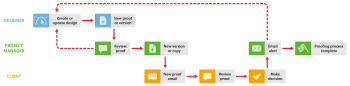

# Internal Then External Review in `Workfront Proof`

>[!IMPORTANT]
>
>This article refers to functionality in the standalone product `Workfront Proof`. For information on proofing inside `Adobe Workfront`, see [Proofing](../../../review-and-approve-work/proofing/proofing.md).

If your organization completes internal reviews before sharing `proofs` with clients, we suggest two ways you can use `Workfront Proof` to enhance your workflow:

## Clients See Internal Comments

This option illustrates a workflow where clients can see all internal comments.

The designer shares the `proof` with the Project Manager (and any other colleagues) first. Colleagues review the `proof` and, if they approve it, you can use the share function to share the `proof` with your clients. For more information, see [Share a Proof in Workfront Proof](../../../workfront-proof/wp-work-proofsfiles/share-proofs-and-files/share-proof.md).

1. `Create a new `proof`` - the designer creates a new `proof` in `Workfront Proof` and shares it will internal reviewers. The designer makes the project manager the owner of the `proof`.

1. `Internal review` - the Project Manager and other colleagues review the `proof`.

1. `Share `proof`` - the Project Manager shares the `proof` with the client.

1. `New `proof` email` - the client receives the New `proof` email with the Go to `proof` link. For more information, see [New proof email](../../../workfront-proof/wp-emailsntfctns/proof-notifications-and-reminders/new-proof-email.md).

1. `Review `proof`` - the client reviews the `proof`, adds comments&nbsp;and makes a decision. 

1. `Email alert` - the Project Manager receives an email alert (depending on his settings on the `proof`). For more information, see [Configure email notification settings in Workfront Proof](../../../workfront-proof/wp-emailsntfctns/email-alerts/config-email-notification-settings-wp.md).

1. `Change request` - the Project Manager lets the designer know about the change requests. This can be done using the print comments function. For more information, see [Print and Export Comments in Workfront Proof](../../../workfront-proof/wp-work-proofsfiles/organize-your-work/print-and-export-comments.md).

1. `New Version` (if required) - the designer amends the file and uploads it to `Workfront Proof` as a new version. For more information, see .

You can repeat this process until the `proof` is approved.

## Client Sees Only Their Own Version

This option illustrates a workflow where the `proofing` process is managed by the Project Manager who creates any new versions (as required) and shares the `proof` with the client. The designer does not need to be involved in the review process.)

<ol> 
 <li value="1">Create a new proof - The designer creates a new proof in Workfront Proof and shares it with internal reviewers. The designer makes the Project Manager the Owner&nbsp;of the proof, or alternatively gives him the role of Author&nbsp;on the proof (see <a href="../../../workfront-proof/wp-work-proofsfiles/share-proofs-and-files/manage-proof-roles.md" class="MCXref xref">Manage Proof Roles in Workfront Proof</a>).</li> 
 <li value="2">Internal review - the Project Manager and other colleagues review the proof. For more information, see <a href="https://support.workfront.com/hc/en-us/sections/115000275214-Reviewing-Proofs-in-the-Web-Proofing-Viewer">Reviewing Proofs in the Web Proofing Viewer</a> and <a href="https://support.workfront.com/hc/en-us/sections/360000686434-Reviewing-Proofs-in-the-Desktop-Proofing-Viewer">Reviewing Proofs in the Desktop Proofing Viewer.</a></li> 
 <li value="3">New version - the Project Manager creates a new version (or a copy) of the proof and shares it with the client. See <a href="../../../workfront-proof/wp-work-proofsfiles/create-proofs-and-files/copy-proofs.md" class="MCXref xref">Copying Proofs in Workfront Proof</a> and <a href="../../../workfront-proof/wp-work-proofsfiles/share-proofs-and-files/share-proof.md" class="MCXref xref">Share a Proof in Workfront Proof</a>.</li> 
 <li value="4">New proof email - the client receives the New proof email with a Go to proof link.&nbsp;For more information, see <a href="../../../workfront-proof/wp-emailsntfctns/proof-notifications-and-reminders/new-proof-email.md" class="MCXref xref">New proof email</a>.</li> 
 <li value="5">Review proof - the client reviews the proof, adds comments and makes a decision.</li> <note type="note">
  The client can see only the version of the 
  proof that has been explicitly shared with them; they will not be able to see the internal version.
 </note> 
 <li value="6">Email alert - the Project Manager receives an email with a summary of the client's review (depending on their settings on the proof).</li> 
 <li value="7">Change request - the Project Manager lets the designer know about the change requests. This can be done using the print comments function.&nbsp;For more information, see <a href="../../../workfront-proof/wp-work-proofsfiles/organize-your-work/print-and-export-comments.md" class="MCXref xref">Print and Export Comments in Workfront Proof</a>.</li> 
 <li value="8">New version (if required) - the designer amends the file and uploads it to Workfront Proof as a new version. For more information, see .</li> 
</ol>

You can repeat this process until the `proof` is approved. 
