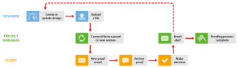

# Working with Designers and Project Managers in `Workfront Proof`

>[!IMPORTANT]
>
>This article refers to functionality in the standalone product `Workfront Proof`. For information on proofing inside `Adobe Workfront`, see [Proofing](../../../review-and-approve-work/proofing/proofing.md).

You can enhance the `proofing` workflow for the project manager (the person managing the reviewing process) and the designer who work together on a project in the two ways described below.

These workflows work well in any situation, but they are especially helpful if your designer&nbsp;creates files that might be too large to email to the project manager.&nbsp;

## When the Designer Needs to See Comments and Decisions

When the designer needs to see comments and decisions made on a `proof`, he or she can begin the `proofing` process and receive the `proof` again when the process is complete. The designer can then begin the process again. 

1. The designer creates a new `proof` and assigns the project manager as the owner of the project (for more information, see [Generate Proofs in Workfront Proof](../../../workfront-proof/wp-work-proofsfiles/create-proofs-and-files/generate-proofs.md)). As the creator of the `proof`, the designer can:

  * Comment on the `proof` and use the Actions tab to keep track of comment threads. 
  * Create a new version of the `proof` for the project manager.  
  
    <!--  
    For more information, see .  
    -->

1. The project manager reviews the `proof` and then shares it with the client. For more information, see [Share a Proof in Workfront Proof](../../../workfront-proof/wp-work-proofsfiles/share-proofs-and-files/share-proof.md).

1. The client receives an email containing a link to the `proof`. For more information, see [New proof email](../../../workfront-proof/wp-emailsntfctns/proof-notifications-and-reminders/new-proof-email.md).

1. The client reviews the `proof`, adds comments, and makes a decision on the `proof`.
1. The project manager receives an email summarizing the client's review and the designer receives an email about the required changes. For more information, see [Configure email notification settings in Workfront Proof](../../../workfront-proof/wp-emailsntfctns/email-alerts/config-email-notification-settings-wp.md).
1. The designer or project manager amends the file; if the designer then uploads it as a new version, `Workfront Proof` reassigns the ownership of the `proof` to the project manager. 

   <!--
   For more information, see .
   -->

## When the Designer Doesn't Need to See Proof Comments and Decisions

When it is not necessary for the designer to be involved in the `Workfront Proof` review process, the project manager can create the `proof` and add the reviewers.&nbsp;

1. The designer uploads the file and shares it with the project manager. For more information, see [Upload Files and Web Content to Workfront Proof](../../../workfront-proof/wp-work-proofsfiles/create-proofs-and-files/upload-files-web-content.md) and [Share Files in Workfront Proof](../../../workfront-proof/wp-work-proofsfiles/share-proofs-and-files/share-files.md).

1. The project manager receives the file and can create a `proof` from the file with just one click. For more information, see [Generate Proofs in Workfront Proof](../../../workfront-proof/wp-work-proofsfiles/create-proofs-and-files/generate-proofs.md) see also  [Manage Files in Workfront Proof](../../../workfront-proof/wp-work-proofsfiles/manage-your-work/manage-files.md) for information about converting files to `proofs`.

1. The client receives an email containing a link to the `proof`. For more information, see [New proof email](../../../workfront-proof/wp-emailsntfctns/proof-notifications-and-reminders/new-proof-email.md).

1. The client reviews the `proof`, adds comments and makes a decision.
1. The project manager receives an email with a summary of the client's review and their decision. For more information, see [Configure email notification settings in Workfront Proof](../../../workfront-proof/wp-emailsntfctns/email-alerts/config-email-notification-settings-wp.md).
1. The project manager lets the designer know about the change requests using&nbsp;Print comments. For more information, see [Print and Export Comments in Workfront Proof](../../../workfront-proof/wp-work-proofsfiles/organize-your-work/print-and-export-comments.md).
1. If necessary, the designer amends the file and uploads it to `Workfront Proof`, where the project manager can create a new version for another round of `proofing`. 

   <!--
   For more information, see .
   -->

