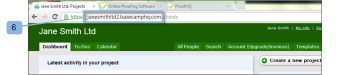

# Integrate `Workfront Proof` with Basecamp Classic

>[!IMPORTANT]
>
>This article refers to functionality in the standalone product `Workfront Proof`. For information on proofing inside `Adobe Workfront`, see [Proofing](../../../review-and-approve-work/proofing/proofing.md).

If you use Basecamp for project management you can offer your project team richer review and approval tools using `Workfront Proof`.

## Understanding the Basecamp Integration with `Workfront`

Integrating with Basecamp allows users to view, review, and approve `proofs` all within Basecamp. Users can submit `proofs` to your `Workfront Proof` account and connect them with your Basecamp project. Your reviewers can  and make [Make a decision on a proof in the proofing viewer](../../../review-and-approve-work/proofing/reviewing-proofs-within-workfront/make-a-decision-on-a-proof/make-decisions-on-proof.md) via Basecamp, using the mini `proof` embedded in your Basecamp message.

When integrated with `Workfront Proof`, Basecamp allows users to do the following with `proofs`:

<ul> 
 <li>Users can review and approve proofs within Basecamp Classic.</li> 
 <li>Users have review tools readily available.</li> 
 <li>Project review teams receive a message in Basecamp with a mini proof for review and approval.</li> 
 <li>Users can switch to a full-page proof for review and approval.</li> 
 <li> 
Users can add comments and markups to both mini- and full-sized proofs.
 <note type="note">
   Once a comment has been replied to, it cannot be edited or deleted.
  </note> </li> 
 <li>Reviewers can respond to the and markups made by other reviewers.</li> 
 <li>Users are alerted when a new version of proof is available.</li> 
 <li>Users who are not Workfront Proof users can work on a proof in Basecamp.</li> 
</ul>

The integration of `Workfront Proof` with Basecamp must be set up on two levels:

* Configure Basecamp in [Account settings:](https://support.workfront.com/hc/en-us/sections/115000912147-Account-settings)&nbsp;This enables the Basecamp integration for your whole organization. 
* For more information, see [Enabling the Basecamp Integration with Workfront Proof](#enabling-the-basecamp-integration-with-workfront-proof).
* Configure Basecamp in [Personal settings](https://support.workfront.com/hc/en-us/sections/115000921168-Personal-settings): This enables `proof` creators and owners to connect to their personal Basecamp account and to authorize `Workfront Proof` access. For more information, see [Configuring Personal Settings](#configuring-personal-settings).

You can integrate `Workfront` with either Basecamp or Basecamp Classic. Each version of Basecamp uses a different API and, therefore, requires different configuration procedures.

For information on configuring Basecamp Classic, see [Enabling the Basecamp Integration with Workfront Proof](#enabling-the-basecamp-integration-with-workfront-proof) in this article.

For information on configuring Basecamp, see [Integrate Workfront Proof with Basecamp](../../../workfront-proof/wp-integrations/basecamp/integrate-workfront-proof-with-basecamp.md).

## Enabling the Basecamp Integration with `Workfront Proof`

As a [Proof Permissions Profiles in Workfront Proof](../../../workfront-proof/wp-acct-admin/account-settings/proof-perm-profiles-in-wp.md) or [Proof Permissions Profiles in Workfront Proof](../../../workfront-proof/wp-acct-admin/account-settings/proof-perm-profiles-in-wp.md), you can set up Basecamp integration for the whole account in your [Account settings](https://support.workfront.com/hc/en-us/sections/115000912147-Account-settings).

<ol> 
 <li value="1">Go to <a href="https://support.workfront.com/hc/en-us/sections/115000912147-Account-settings">Account settings.</a></li> 
 <li value="2">Open the Integrations tab (1).</li> 
 <li value="3">To enable the Basecamp integration, click Enable (2).</li> 
 <li value="4">Verify that Basecamp Classic is the version you are integrating with (3).</li> 
 <li value="5">(Conditional) If no Basecamp URL displays (4), click Edit and enter the URL for your Basecamp account (without the http://).</li> 
 <li value="6">Click Save (5). </li> 
 <li value="7"> 
(Optional) Check your Basecamp URL in your browser after logging into your Basecamp Classic account (6).
 
  
 
Once you integrate Workfront Proof with Basecamp, your users can configure their personal settings. For information on setting up personal settings, see <a href="#configuring-personal-settings" class="MCXref xref">Configuring Personal Settings</a>.
 
&nbsp;If you cannot enable Basecamp integration, your Workfront Proof account ID might not be the same as the account ID you use in Basecamp.
 </li> 
</ol>

## Configuring Personal Settings

After you set up [Account settings](https://support.workfront.com/hc/en-us/sections/115000912147-Account-settings) for your Organization, each of your authors that creates/submits `proofs` should set their&nbsp; [personal settings.](https://support.workfront.com/hc/en-us/sections/115000921168-Personal-settings)

>[!NOTE]
>
>Completing these steps is easiest if you have your Basecamp session open in one browser window and your `Workfront Proof` session open in another window.

* [Retrieving Your Basecamp API Token](#retrieving-your-basecamp-api-token) 
* [Adding Your Basecamp API token to Your Personal Settings](#adding-your-basecamp-api-token-to-your-personal-settings)

### Retrieving Your Basecamp API Token

To complete integration at the individual level in `Workfront Proof`, users need their individual authentication token for the Basecamp API.

To retrieve your Basecamp API token:

<ol> 
 <li value="1">Sign in to your Basecamp account.</li> 
 <li value="2">Click My Info (1) in the upper-right corner of the screen. The My Info page displays. </li> 
 <li value="3">In the Authentication tokens section, click Show your tokens (2) to display your personal authentication tokens.</li> 
 <li value="4">Select the Token for feed readers or the Basecamp API (3), then copy the token to your clipboard.</li> 
 <li value="5">Paste your Basecamp API token into the Token for feed readers or the Basecamp API box. </li> 
</ol>

### Adding Your Basecamp API token to Your Personal Settings&nbsp;

To paste the Basecamp API token into your `Workfront Proof` [Personal settings](https://support.workfront.com/hc/en-us/sections/115000921168-Personal-settings):

1. Go to the [Integrations - User Setup](../../../workfront-proof/wp-getstarted/personal-settings/integrations-user-setup.md) in your [Personal settings](https://support.workfront.com/hc/en-us/sections/115000921168-Personal-settings)&nbsp;(1).  
   An administrator must first enable&nbsp;the Basecamp Classic integration in order for you enable your personal settings. For information on setting up the integration, see [Enabling the Basecamp Integration with Workfront Proof](#enabling-the-basecamp-integration-with-workfront-proof) in this article.

1. In the Basecamp API token box (2), paste the token that you just copied from your Basecamp My Info page into the field (3).  
   For information on copying your Basecamp API token, see [Retrieving Your Basecamp API Token](#retrieving-your-basecamp-api-token) in this article.

1. Click `Save` (4).

Your `Workfront Proof` [Personal settings](https://support.workfront.com/hc/en-us/sections/115000921168-Personal-settings) are now integrated with your Basecamp Classic account.
