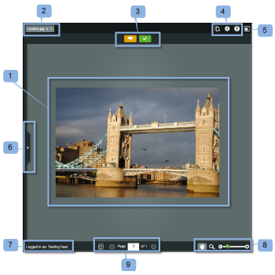

# Review a Proof in Basecamp Classic

>[!IMPORTANT]
>
>This article refers to functionality in the standalone product `Workfront Proof`. For information on proofing inside `Adobe Workfront`, see [Proofing](../../../review-and-approve-work/proofing/proofing.md).

Basecamp is an online project management tool developed by 37signals. If you use Basecamp for project management you can offer your project team richer review and approval tools using `Workfront Proof`.

## Understanding Proof Reviews in Basecamp Classic

When integrated with `Workfront Proof`, Basecamp allows users to do the following with `proofs`:

<ul> 
 <li>Users can review and approve proofs within Basecamp Classic.</li> 
 <li>Users have review tools readily available.</li> 
 <li>Project review teams receive a message in Basecamp with a mini proof for review and approval.</li> 
 <li>Users can switch to a full-page proof for review and approval.</li> 
 <li>Users can add comments and markups to both mini- and full-sized proofs. </li> <note type="note">
   Once a comment has been replied to, it cannot be edited/deleted. For information about comments, see 
  <a href="../../../review-and-approve-work/proofing/reviewing-proofs-within-workfront/comment-on-a-proof/comment-on-proof.md" class="MCXref xref">Comment on a proof</a>.
 </note> 
 <li>Reviewers can respond to the and markups made by other reviewers. For information about comments, see <a href="../../../review-and-approve-work/proofing/reviewing-proofs-within-workfront/comment-on-a-proof/comment-on-proof.md" class="MCXref xref">Comment on a proof</a>.</li> 
 <li>Users are alerted when a new version of proof is available.</li> 
 <li>Users who are not Workfront Proof users can work on a proof in Basecamp.</li> 
</ul>

## Viewing a Proof via the Notification Email

If you link a `proof` to Basecamp, `Workfront Proof` sends a `proof` notification email (1) to all reviewers, containing the following information:

* `Proof details` (2): Displays information about the `proof`. The information that displays depends on how your `Workfront administrator` has configured Basecamp.

* `Go to Proof link` (3): Opens the `proof` in `Workfront`.&nbsp;

* `Basecamp URL` (4): Opens the `proof` in Basecamp. If non-Basecamp reviewers are added to the `proof`, their email notification does not include the Basecamp link.

* `Proof progress` (5): Lists the stages of approval and displays the Proof progress indicators.
* `Stage` (6): Lists the reviewers and their individual progress.

To open the `proof` from the email notification:

1. To open the `proof` in `Workfront Proof`, click `Go To Proof`.  
   For information on reviewing a `proof` in `Workfront Proof`, see [Reviewing a Proof in the Legacy Proofing Viewer](../../../review-and-approve-work/proofing/reviewing-proofs-within-workfront/review-proof-in-legacy-proofing-viewer.md).  
   Or  
   To open the `proof` in Basecamp, click the URL listed in the `Basecamp URL` field.  
   For information on reviewing a `proof` in Basecamp Classic, see [Reviewing a Proof in Basecamp](#reviewing-your-proof-in-basecamp) in this article.

## Viewing the Proof via the Basecamp Classic Message

You can access a `proof` from a Basecamp Classic message.&nbsp;

<ol> 
 <li value="1">In Basecamp, go to your project page (1). </li> 
 <li value="2">Click the message for the proof you want to open. (2) The message for the proof opens, displaying a mini proof. The name of the proof displays at the top of the message window (3). You can either view the thumbnail proof in Basecamp Classic or in Workfront Proof. </li> 
 <li value="3">To view the proof in full-screen mode in Workfront proof, click the URL listed above the proof (4).</li> 
 <li value="4">(Conditional) If you are not logged into your Workfront Proof account in one of your browser windows, log to review the proof:
  <ol>
   <li value="1">Click Sign In&nbsp;(5) above the proof.</li>
   <li value="2">Type your email address (6). You must use the same email address that was used when you were added to the proof.</li>
   <li value="3">Click Next.</li>
   <li value="4">Type your Workfront Proof password (7). Or If you do not have a Workfront Proof account, type a public name to display.  You can select "remember me" so you only have to input your details once.</li>
  </ol></li> 
 <li value="5">To review the proof, continue with <a href="#reviewing-your-proof-in-basecamp" class="MCXref xref">Reviewing a Proof in Basecamp</a>.</li> 
</ol>

>[!NOTE]
>
>The comment box shown below the mini `proof` on the message page applies only to the message itself. To submit review comments, you must use the comments icon button at the top of the mini `proof` or the larger Comments button at the top of the full-page `proof`. For more information, see Reviewing a [Reviewing a Proof in Basecamp](#reviewing-your-proof-in-basecamp).

## Reviewing a Proof in Basecamp

The mini `proof` in Basecamp provides you with the tools you need to add and to make [Make a decision on a proof in the proofing viewer](../../../review-and-approve-work/proofing/reviewing-proofs-within-workfront/make-a-decision-on-a-proof/make-decisions-on-proof.md) on the `proof`. All users assigned to the project see your markups and comments and can respond with their own comments in a real time.

When you open the `proof`, the `proof` displays in the `proofing` window (1) and the name of the proof and version number displays in the upper-left corner (2).

To review the `proof`:

1. To add a comment, click Comment (3) at the top of the `proof`, and type your comment.  
   There is no need to send a response to the Basecamp message, as the comments and [Make a decision on a proof in the proofing viewer](../../../review-and-approve-work/proofing/reviewing-proofs-within-workfront/make-a-decision-on-a-proof/make-decisions-on-proof.md) saved to the `proof` (similar to reviewing a `proof` within `Workfront Proof`).

1. To add a decision, click Decision (3) at the top of the `proof`, and select your approval decision.  
   For more information on making decisions on a `proof`, see [Make a decision on a proof in the proofing viewer](../../../review-and-approve-work/proofing/reviewing-proofs-within-workfront/make-a-decision-on-a-proof/make-decisions-on-proof.md#making-a-decision-on-a-proof).

Other features on the `proof` window include:

* `Action menus` (4): Allows you to select settings for the `proof`.

* `Full-screen button` (5): Allows you to toggle between full-screen and mini- `proof`.

* `Sidebar` (6): Allows you to expand or shrink view of `proof`.

* `Username` (7): Displays your username if you are logged into `Workfront`.

* `Zoom tools` (8): Allows you to magnify an area of the `proof`.

* `Page navigation tools` (9): Allows you to scroll to other pages within the `proof`.

For more information on reviewing `proofs`, see [Legacy proofing viewer Overview](../../../workfront-proof/wp-work-proofsfiles/review-proofs-lpv/legacy-proofing-viewer.md).
