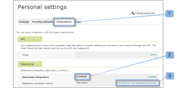
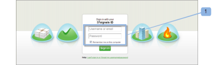
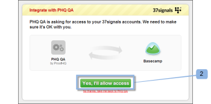
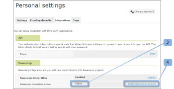

# Integrate *Workfront Proof* with Basecamp

>[!IMPORTANT]
>
>This article refers to functionality in the standalone product *Workfront Proof*. For information on proofing inside *Adobe Workfront*, see [Proofing](../../../review-and-approve-work/proofing/proofing.md).

If you use Basecamp for project management you can offer your project team richer review and approval tools using *Workfront Proof*.

## Understanding the Basecamp Integration with *Workfront*

Integrating with Basecamp allows users to view, review, and approve *proofs* all within Basecamp. Users can submit *proofs* to your *Workfront Proof* account and connect them with your Basecamp project. Your reviewers can&nbsp;comment and make decisions via Basecamp, using the mini *proof* embedded in your Basecamp message.

When integrated with *Workfront Proof*, Basecamp has the following *proofing* functionality:

<ul> 
 <li>Users can review and approve <em>proofs</em> within Basecamp Classic.</li> 
 <li>Users have review tools readily available.</li> 
 <li>Project review teams receive a message in Basecamp with a mini <em>proof</em> for review and approval.</li> 
 <li>Users can switch to a full-page <em>proof</em> for review and approval.</li> 
 <li>Users can add comments and markups to both mini- and full-sized <em>proofs</em>. <note type="note">
    Once a comment has been replied to, it cannot be edited or deleted.
  </note></li> 
 <li>Reviewers can respond to the and markups made by other reviewers.</li> 
 <li>Users are alerted when a new version of <em>proof</em> is available.</li> 
 <li>Users who are not <em>Workfront Proof</em> users can work on a <em>proof</em> in Basecamp.</li> 
</ul>

The integration of *Workfront Proof* with Basecamp must be set up on two levels:

* Configure Basecamp in [Account settings:](https://support.workfront.com/hc/en-us/sections/115000912147-Account-settings)&nbsp;This enables the Basecamp integration for your whole organization. For more information, see [Enabling the Basecamp Integration with Workfront Proof](#enabling-the-basecamp-integration-with-workfront-proof).

* Configure Basecamp in [Personal settings](https://support.workfront.com/hc/en-us/sections/115000921168-Personal-settings): This enables *proof* creators and owners to connect to their personal Basecamp account and to authorize *Workfront Proof* access. For more information, see [Configuring Personal Settings](#configuring-personal-settings).

You can integrate *Workfront* with either Basecamp or Basecamp Classic. Each version of Basecamp uses a different API and, therefore, requires different configuration procedures.

For information on configuring Basecamp Classic, see [Integrating *Workfront Proof* with Basecamp Classic.](https://support.workfront.com/knowledge/articles/115004234707/en-us?brand_id=662728&return_to=%2Fhc%2Fen-us%2Farticles%2F115004234707)

## Enabling the Basecamp Integration with *Workfront Proof*

As a [Proof Permissions Profiles in Workfront Proof](../../../workfront-proof/wp-acct-admin/account-settings/proof-perm-profiles-in-wp.md) or [Proof Permissions Profiles in Workfront Proof](../../../workfront-proof/wp-acct-admin/account-settings/proof-perm-profiles-in-wp.md), you can set up the Basecamp integration for the whole account in your [Account settings](https://support.workfront.com/hc/en-us/sections/115000912147-Account-settings).

<ol> 
 <li value="1">In Basecamp, collect the following information: 
  <ul>
   <li>The URL for your Basecamp account</li>
   <li>The URL found in the "My info" section</li>
  </ul></li> 
 <li value="2">Log out of Basecamp.</li> 
 <li value="3">Click Account settings near the upper-right corner.</li> 
 <li value="4">Click the Integrations tab.</li> 
 <li value="5">In the Basecamp section, to the right of Basecamp integration, click Enable.</li> 
 <li value="6">Next to Basecamp version, verify the Classic version is the version you are integrating with.</li> 
 <li value="7">(Conditional) If no Basecamp URL displays, click Edit, type the URL for your Basecamp account, without including "http://," and then click Save.</li> 
 <li value="8">In the upper-right corner of the window, click Settings > Personal settings.</li> 
 <li value="9">Click the Integrations tab.</li> 
 <li value="10">Under Basecamp, to the right of Basecamp integration, click Enable.</li> 
 <li value="11">In the options appear, to the right of Basecamp API Token, click Edit.</li> 
 <li value="12">In the box that appears, type the URL found in the "My info" section in Basecamp, then click Save. Once you integrate <em>Workfront Proof</em> with Basecamp, your users can configure their personal settings. For information on setting up personal settings, see <a href="#configuring-personal-settings" class="MCXref xref">Configuring Personal Settings</a></li> <note type="note">
  &nbsp;If you cannot enable Basecamp integration, your 
  <em>Workfront Proof</em> account ID might not be the same as the account ID you use in Basecamp.
 </note> 
 <li value="13">Once you integrate <em>Workfront Proof</em> with Basecamp, your users can configure their personal settings. For information on setting up personal settings, see <a style="background-color: #ffffff;" href="#configuring-personal-settings" class="MCXref xref">Configuring Personal Settings</a>.</li> 
</ol>

## Configuring Personal Settings

After you set up [Account settings](https://support.workfront.com/hc/en-us/sections/115000912147-Account-settings) for your Organization, each one of your authors that creates/submits *proofs* should set their&nbsp; [personal settings.](https://support.workfront.com/hc/en-us/sections/115000921168-Personal-settings)

<ol> 
 <li value="1">Go to Personal settings.</li> 
 <li value="2">Open the Integrations tab&nbsp;(1).</li> 
 <li value="3">To enable the Basecamp integration, click Enable (2).</li> 
 <li value="4">Click Connect to your Basecamp account (3).  </li> 
 <li value="5">Log in to your Basecamp account (1). </li> 
 <li value="6">Click Yes, I'll allow access to authorize <em>Workfront Proof</em> access to your account (2). </li> 
 <li value="7">(Optional) When your personal integration is active (3), you can switch easily between your Basecamp accounts. 
  <ol style="list-style-type: lower-alpha;">
   <li value="1">Clicking Switch Basecamp account (4).  The Switch Basecamp Account takes you to the Personal Settings page, where you can choose which of your Basecamp accounts you want to integrate with your <em>Workfront Proof</em> account.</li>
   <li value="2">Click Re-Integrate with Basecamp (5) before choosing the Basecamp account This refreshes the Personal Settings page and shows your most up-to-date list of Basecamp accounts.</li>
   <li value="3">Click Integrate with this account to connect it with <em>Workfront Proof</em>.  You can now add <em>proofs</em> to Basecamp projects.</li>
  </ol></li> 
</ol>

