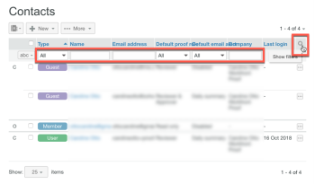

# Manage Your Contacts in `Workfront Proof`

>[!IMPORTANT]
>
>This article refers to functionality in the standalone product `Workfront Proof`. For information on proofing inside `Adobe Workfront`, see [Proofing](../../../review-and-approve-work/proofing/proofing.md).

You can manage your colleagues, members, and guests on the Contacts page.

## Opening the Contacts Page

1. Click `Contacts` in the left navigation sidebar.
1. (Optional) Click `Change view`, then select an option to specify whether you want to view by contact or by company.

## Sorting Contacts

<ol> 
 <li value="1">Click Contacts in the left navigation sidebar.</li> 
 <li value="2">Click the column heading you want to sort by. Or Select an option from the Sort menu in the upper-right corner of the Contacts page.</li> 
 
  
 
 
The triangle on a column heading indicates sorting order. Pointed upward, it indicates ascending order; pointing downward indicates descending order.
 
</ol>

## Filtering Contacts

<ol> 
 <li value="1">Click Contacts in the left navigation sidebar.</li> 
 <li value="2">Click the&nbsp;Filter&nbsp;icon&nbsp;to the far-right of the column headings to display the filtering options below the column headings.</li> 
 <li value="3">Select filtering options from the dropdown menus and type in the filtering boxes that appear below each column header, then click the&nbsp;Filter&nbsp;icon again to apply the options.</li> 
 
  
 
 
Or
 
 
Select the first letter in the name of the contact you want. 
 
 
  
 
</ol>

## Managing One or More Contacts

<ol> 
 <li value="1">Click Contacts in the left navigation sidebar.</li> 
 <li value="2">Select the checkbox for one or more contact.</li> 
 <li value="3">Do any of the following: 
  <ul> 
   <li>Click Add to Group to add the selected contacts to a Group. </li> 
   <li>Click Remove, then click an option in the drop-down menu to remove the contact from proofs or groups.</li> 
   <li>Click More&nbsp;>&nbsp;Send reminder on late proofs to send a reminder email to the selected contacts about any late proofs.</li> 
   <li>Click More > Export contacts to CSV to export the selected contacts to a CSV file.</li> 
   <li>Click Delete contacts to remove the selected contacts from your list.  Deleting a contact does not mean that a user is removed from your account; however if an Administrator or Billing Administrator deletes someone from the contacts list, that person will be deleted from your organization's account altogether.</li> 
   <li>Click the More icon at the end of a contact's row and use any of the options in the drop-down menu that appears. These options are different for for different types of contacts. See <a href="../../../workfront-proof/wp-mnguserscontacts/contacts/use-members-guests.md" class="MCXref xref">Understand Users, Members, and Guests in Workfront Proof</a> for more information.</li> 
  </ul></li> 
</ol>

## Importing Contacts

You can import contacts from a CSV file.

<ol> 
 <li value="1">Click Contacts in the left navigation sidebar.</li> 
 <li value="2">On the Contacts page, click More > Import contacts to add contacts to your list.</li> 
 <li value="3">On the Import people page that appears, click Choose File.</li> 
 <li value="4">Select the field separation method in the file.</li> 
 <li value="5">Click Save.</li> <note type="note">  
  <ul> 
   <li>The CSV file must have at least one column called "Email" (containing the email addresses).</li> 
   <li>You can also include additional columns for "Name," "Company," "Telephone" and "Mobile."</li> 
   <li>Instead of "Name" you may use two columns for "First Name" and "Last Name". If separate first and last name columns are used, you must ensure you do not also include a "Name" column.</li> 
  </ul> 
 </note> 
</ol>

