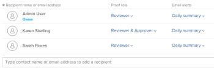

# Add Groups to a Proof

>[!IMPORTANT]
>
>This article refers to functionality in the standalone product `Workfront Proof`. For information on proofing inside `Adobe Workfront`, see [Proofing](../../../review-and-approve-work/proofing/proofing.md).

Add a group to a `proof` to automatically send the content to all group members. ``

For information about how to create a group, see [Create Proofing Groups using Workfront Proof](../../../workfront-proof/wp-mnguserscontacts/groups/create-proofing-groups.md).

<ol> 
 <li value="1"> Start creating a proof using one of the following methods: 
  <ul>
   <li> Create a standard proof.  For more information, see <a href="../../../workfront-proof/wp-work-proofsfiles/create-proofs-and-files/generate-proofs.md" class="MCXref xref">Generate Proofs in Workfront Proof</a>.</li>
   <li> Create a new proof version. For more information, see .</li>
   <li>Make a copy of a proof. For more information, see <a href="../../../workfront-proof/wp-work-proofsfiles/create-proofs-and-files/copy-proofs.md" class="MCXref xref">Copying Proofs in Workfront Proof</a>.</li>
  </ul></li> 
 <li value="2">In the&nbsp;Workflow&nbsp;section, begin typing the group name in the&nbsp;Type contact name or email address to add a recipient&nbsp;field.  </li> 
 <li value="3">Select the group name. Members of the group now display.   </li> 
 <li value="4">(Optional) Change an individual member's&nbsp;Proof role&nbsp;or&nbsp;Email alerts with the drop-down menus. For more information, see <a href="../../../workfront-proof/wp-work-proofsfiles/share-proofs-and-files/manage-proof-roles.md" class="MCXref xref">Manage Proof Roles in Workfront Proof</a>&nbsp;and <a href="../../../workfront-proof/wp-emailsntfctns/email-alerts/config-email-notification-settings-wp.md" class="MCXref xref">Configure email notification settings in Workfront Proof</a>. </li> 
 <li value="5">(Optional) Delete a group member from the proof by hovering over the user's information and clicking the&nbsp;X.&nbsp; Or Delete all members from the proof by clicking Delete all. </li> 
 <li value="6">Continue creating the proof as described in <a href="../../../workfront-proof/wp-work-proofsfiles/create-proofs-and-files/generate-proofs.md" class="MCXref xref">Generate Proofs in Workfront Proof</a>&nbsp;&nbsp;or&nbsp;<a href="../../../workfront-proof/wp-work-proofsfiles/create-proofs-and-files/copy-proofs.md" class="MCXref xref">Copying Proofs in Workfront Proof</a>.&nbsp; </li> 
</ol>

