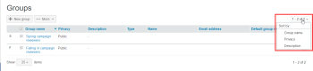
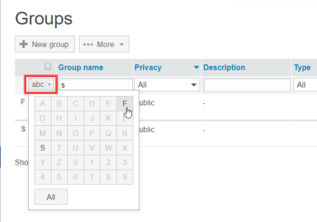

# Manage Groups using `Workfront Proof`

>[!IMPORTANT]
>
>This article refers to functionality in the standalone product `Workfront Proof`. For information on proofing inside `Adobe Workfront`, see [Proofing](../../../review-and-approve-work/proofing/proofing.md).

As a `Workfront Proof administrator`, you can manage your public and private Groups on the Groups page.

For more information about Groups, see [Manage Groups using Workfront Proof](#).

## Opening the Groups Page

<ol> 
 <li value="1">Click Groups in the left navigation sidebar. On the Groups page, you can: 
  <ul> 
   <li>View all your public and private Groups.</li> 
   <li>Create a new Group. For more information, see <a href="../../../workfront-proof/wp-mnguserscontacts/groups/create-proofing-groups.md" class="MCXref xref">Create Proofing Groups using Workfront Proof</a>.</li> 
   <li>Export Groups to CSV file.</li> 
   <li>Filter and sort Groups.</li> 
   <li>After you select one or more Groups the following additional options are available: 
    <ul> 
     <li>Add people to the selected Groups. </li> 
     <li>Make the selected Groups private or&nbsp;public, as described in <a href="../../../workfront-proof/wp-mnguserscontacts/groups/make-groups-private.md" class="MCXref xref">Make Groups Private using Workfront Proof</a></li> <note type="note">
      Private Groups are&nbsp;visible only to their creators.&nbsp;
     </note> 
     <li>Delete the selected Groups. </li> 
    </ul></li> 
   <li>You can perform actions on Groups also on each Group separately from their own More (three dot) menu:   
    <ul> 
     <li>View Group details. You can also view Group details by clicking on the Group name.</li> 
     <li>Add people.</li> 
     <li>Make a Group public/private.</li> 
     <li>Delete a Group.</li> 
    </ul></li> 
  </ul></li> 
</ol>

## Sorting Groups

You can Sort Groups by Group name, privacy status, and description.

<ol> 
 <li value="1">Click the column heading you want&nbsp;to sort by.  Or Select a sorting option from the Sort menu.   The triangle on a column heading indicates sorting order. Pointed upward, it indicates ascending order; pointing downward indicates descending order.</li> 
</ol>

## Filtering Groups

<ol> 
 <li value="1">Click the Filter icon to the far-right of the column headings to display the filtering options below the column headings. </li> 
 <li value="2">Select filtering options from the dropdown menus and type in the filtering boxes that appear below each column header, then click the Filter icon again to apply the options. Or Select the first letter in the Group name.  </li> 
</ol>

## Viewing and Editing Group Details

<ol> 
 <li value="1">Click the More button to the far-right of the Group name, then click View group details in the drop-down menu. On the page that appears, you can view&nbsp;all the people currently in the Group, along with their default roles and email alerts for the Group.</li> 
 <li value="2">Do any of the following the edit the Group details: 
  <ul> 
   <li>Edit the Group name and Description&nbsp;by clicking it and typing. Clicking anywhere outside the field saves your changes.</li> 
   <li>Click Privacy to change the Group privacy setting in the drop-down menu.</li> 
   <li>Click Add to group to add new people to the Group. </li> 
   <li>Click Delete group in the upper-right corner to delete the group. </li> 
   <li>Click the checkbox at the beginning of a Group member's row and use any of the options that appear just above the list. </li> 
   <li>Click the More icon at the end of a Group member's row and use any of the options in the drop-down menu. </li> 
  </ul></li> 
</ol>

## Adding Contacts to Groups

<ol> 
 <li value="1">Click Contacts in the left navigation panel to go&nbsp;to the&nbsp;Contacts&nbsp;page.</li> 
 <li value="2">Select the check boxes next to the name or names of the contacts you want to add to a group.</li> 
 <li value="3">Click the&nbsp;Add to group&nbsp;button.  The&nbsp;Add to group&nbsp;dialogue box appears.</li> 
 <li value="4">In the&nbsp;People&nbsp;section: 
  <ol style="list-style-type: lower-alpha;"> 
   <li value="1">Use the drop-down menus to change a member's&nbsp;Role&nbsp;or&nbsp;Email alerts. For more information, see&nbsp;<a href="../../../workfront-proof/wp-work-proofsfiles/share-proofs-and-files/manage-proof-roles.md" class="MCXref xref">Manage Proof Roles in Workfront Proof</a>&nbsp;and&nbsp;<a href="../../../workfront-proof/wp-emailsntfctns/email-alerts/config-email-notification-settings-wp.md" class="MCXref xref">Configure email notification settings in Workfront Proof</a>.</li> 
   <li value="2">Use the&nbsp;Enter a contact name or email address&nbsp;field to add additional contacts to the group.</li> 
  </ol></li> 
 <li value="5">In the&nbsp;Groups&nbsp;section, select the group to which you want to add the contact or contacts.</li> 
 <li value="6">Click&nbsp;Add to group.</li> 
</ol>

