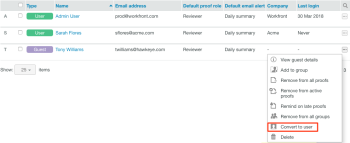

# Create Users using *`Workfront Proof`* {#create-users-using-workfront-proof}

>[!IMPORTANT] {type="important"}
>
>This article refers to functionality in the standalone product *`Workfront Proof`*. For information on proofing inside *`Adobe Workfront`*, see [Proofing](_proofing.md).

As a *`Workfront Proof administrator`*, you can create new users.

For information about administrator rights, see [Proof Permissions Profiles in Workfront Proof](proof-perm-profiles-in-wp.md).

>[!NOTE]
>
>We do not recommend adding third parties to your own account. 

You can create a user from scratch or you can convert a Guest to a licensed user.&nbsp;

## Creating a User {#creating-a-user}

1. Do any of the following to begin creating a user: 
    
    
    * Click the drop-down menu arrow next to  `New *`proof`*`, then click  `New user`.
    
    * Click `Settings` > `Account Settings`, then click `+New User`.
    
    * Click  `Contacts`in the left navigation menu, click `+`  `New`, then click  `New user`.*  
      *The New User dialog box displays.
    
    
    
1. In the `New User` box that appears, type the person's information and set configuration options as described in&nbsp; [Configure User Information using Workfront Proof](configure-user-info.md).

1. Click  `Create.`

## Converting a Guest to a User {#converting-a-guest-to-a-user}

Guests are users who do not have a licensed *`Workfront Proof`* account. If a Guest upgrades to a licensed user account, you need to manually convert a Guest account into a licensed user.&nbsp; 

For more information on Guests and users, see [Understand Users, Members, and Guests in Workfront Proof](use-members-guests.md).&nbsp; 

1. Click `Contacts` in the left navigation menu.
1. Click the  `More` icon to the right of the Guest who you want to convert to a user, then click  `Convert to user`.  
     

1. In the `New User` dialog box that displays, set configuration options for the user, as described in&nbsp; [Configure User Information using Workfront Proof](configure-user-info.md).

1. Click  `Convert to User.`&nbsp;

