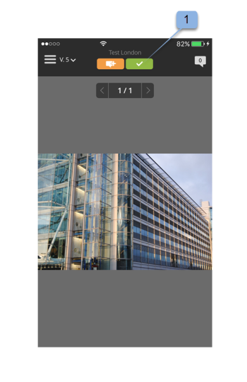

# *Workfront Proof* mobile app

>[!IMPORTANT]
>
>This article refers to functionality in the standalone product *Workfront Proof*. For information on proofing inside *Adobe Workfront*, see [Proofing](../../../review-and-approve-work/proofing/proofing.md).

Download the *Workfront Proof*&nbsp;app from the Apple App Store or Google Store to be productive wherever you are. The *Workfront* Proof app has the following features on the iPhone and iPod Touch:

* View, review, and approve both static and audio-visual *proofs*
* View, add, and reply to comments
* Manage your *proofs* via your dashboard and views

You do not need to be a user of *Workfront Proof* (i.e., have your own login credentials) to review and approve a *proof* via the iOS app. As long as you download the app to your iOS device and access your personal URL via your iOS email app, then you can review and approve on the go.

## Device requirements

Requires iOS 7.0 or later. Android 4.0 and up. Compatible with iPhone, iPad, and iPod touch.

## Download and install the app

Download our *Workfront Proof* Mobile App directly from the [Apple App Store](https://itunes.apple.com/us/app/workfront-proof/id1030372728?mt=8) or the [Google Play Store](https://play.google.com/store/apps/details?id=com.proofhq.tabletapp).

For iOS devices, make sure to uninstall the previous *Workfront Proof* app for iOS devices before installing the new app.

The *Workfront Proof* app automatically detects what type of device you are using. If you&nbsp;would like to use the app on your tablet, see&nbsp; [Workfront Proof mobile app for tablets](../../../workfront-proof/wp-mobile/wp-mobile-apps/wp-mobile-app-tablet.md).

>[!NOTE]
>
>&nbsp;It is not possible to review SWF files or Audio files, such as MP3 on iOS devices, due to the software limitations of mobile devices. If you would like to review a *proof* created from a SWF file or an Audio file on a mobile device, please convert it to a supported&nbsp;format before uploading to&nbsp;*Workfront Proof*.

## Getting started with the app

You do not have to be a *Workfront Proof* user to start using the app. Simply install the app on your device and click a `Go To Proof` link in your email notification. The app automatically starts and loads the *proof*.

If you are a *Workfront Proof* user you can log in to the app before opening any *proofs*. The app allows you to browse all the *proofs* shared with you and to easily switch between them.

1. Open the app.
1. Enter your email and password and tap  `Login`.

   Or `  
   `

   Use Single Sign-On, if it's configured on your *Workfront Proof* account.

   You can use the  `Forgot password` option if you don't remember your&nbsp;password.

## The Dashboard

After you log into your *Workfront Proof* account, the Dashboard appears. Here you can easily access your *proofs*. You can open one of the available views, My *proofs*, and All *proofs*. Alternatively you can tap the name of one of your recent *proofs* to go directly to the *proofing viewer*.

By default, the Dashboard will open the Total *proofs* view. This view shows all the *proofs* that you are the owner of or that were shared with you. You can change the view by tapping&nbsp;the bar at the top of the page to open a drop-down menu containing the On time, At risk, Late and Recent options. To open a *proof* from any view, scroll down the list to find the *proof* you want, then tap its name to go to the *proofing viewer*.

| `On Time View`  |Shows you all active *proofs* in your account that you have permission to see and that have no deadline or there is more than 24 hours until the deadline. |
|---|---|
| `At Risk View`  |Displays all&nbsp;*proofs* for which the deadline is less than 24 hours. |
| `Late View`  |Lists all&nbsp;*proofs* in which not all actions are completed&nbsp;for which the deadline is already breached. |
| `Recent view`  |Includes the *proofs*&nbsp;that have been recently accessed by you&nbsp;and that&nbsp;you own, have permissions to see as per your profile permissions and that were shared with you.&nbsp;This view shows&nbsp;only the *proofs*&nbsp;that you yourself have opened (either via&nbsp;the *Workfront Proof* Viewer or via the Proof details page). |
| `Email link`  |To open a *proof* from your email, simply open the email in your email app, click on the Go to *proof* button link in the email (1) and you will be taken to the *proof* in the *Workfront Proof* app. |

## Review a static *proof* in the app

When you open a *proof* in the mobile&nbsp;app, you can do the following:

<ul> 
 <li>Read and reply to comments left by other reviewers (1 - the digit visible in the icon indicates numbers of comments left on the <em>proof</em>, if no comments were left on the <em>proof</em>, this button will show 0 and will be grayed out).</li> 
 <li>Add comments and markups (2). </li> <note type="note">
   The visibility of the Comment and Decision button depends on your 
  <em>proof</em> role.
 </note> 
 <li>Make a decision (3).</li> 
 <li>Go to the menu&nbsp;(4).</li> 
 <li>Scale the <em>proof</em> by pinching the screen. </li> 
</ul>

## Add comments and replies

<ol> 
 <li value="1"> 
When you have opened a <em>proof</em>, tap the Add comment button (1). 
 
  
 </li> 
 <li value="2"> 
Type your comment (2). 
 
  
 </li> 
 <li value="3">Click Save.</li> 
</ol>

## Read and reply to comments

<ol> 
 <li value="1">Open the <em>proof</em>, then tap the callout icon in the right upper corner to view the comments list&nbsp;(1) and choose the comment that you want to review.</li> 
 <li value="2"> 
Tap the pin to open the comment associated with it (2).
 
  
 </li> 
 <li value="3">Do any of the following: 
  <ul>
   <li>To reply to a comment, tap the Reply button (3).</li>
   <li>To go back to the <em>proof</em> image, tap the callout icon.</li>
   <li>
To view the full comment and its replies, tap on the comment itself. 

</li>
   <li>To apply an action on a comment: 
    <ol style="list-style-type: lower-alpha;">
     <li value="1">Open a comment.</li>
     <li value="2">Tap Reply.</li>
     <li value="3">Open the actions menu on the right side of the text field (1).</li>
     <li value="4">
Tap Add action (2). 

For more information about actions, see <a href="../../../review-and-approve-work/proofing/reviewing-proofs-within-workfront/comment-on-a-proof/use-actions-on-comments-in-viewer.md" class="MCXref xref">Use actions on proof comments</a>.&nbsp;
</li>
    </ol></li>
  </ul></li> 
</ol>

## Add markups

You can&nbsp;add a markup (such as a box highlighting an area on the *proof*) and type a comment that is attached to the markup. You can also make a comment without adding a mark-up.&nbsp;And you can add multiple mark-ups to a single comment.&nbsp;

<ol> 
 <li value="1"> 
On a <em>proof</em> you have opened, tap Add comment&nbsp;(1). 
 
  
 </li> 
 <li value="2"> 
Choose between the pan mode (2), rectangle tool (3), freehand drawing (4), or the arrow tool (5).  
 
You can also change the line color of the markup (6).
 </li> 
 <li value="3"> 
To draw a markup on the <em>proof</em>, touch the screen and then move your finger across the <em>proof</em>. 
 
You don't have to add text to save your markup (7).
 </li> 
 <li value="4"> 
Tap Cancel (8) if you want to discard your markup . 
 
    
 
Marking up an area on the <em>proof</em> automatically opens the comment field. You can remove created markup by tapping the cross next to the markup shape (9). 
 
  
 </li> 
</ol>

## Make decisions on a *proof*

<ol> 
 <li value="1"> 
Open the <em>proof</em> in the Proof Viewer and tap the Decision button (1).
 
  
 </li> 
 <li value="2">Tap the decision you would like to submit (2).</li> 
 <li value="3"> 
Tap Save to submit your decision. 
 
  
 <note type="note"> 
   <ul> 
    <li>If an on decision pop-up message is set on the account in which the <em>proof</em> was created, it will also appear in the iOS app when a decision is made on a <em>proof</em>.<em>&nbsp;</em></li> 
    <li>If you set up decision reasons, they will display on the Submit your decision screen for you to choose.<em> </em></li> 
   </ul> 
  </note> 
If you have already submitted a decision and you want to change it or remove it, you can easily do so. After sumitting a decision, a new option,&nbsp;Remove my decision (6), appears on the Submit your decision screen.
 
  
 </li> 
</ol>

## Review an audio or video *proof* in the app

Reviewing an audio-video *proof* in the iOS app is just as simple as reviewing a static file:

<ol> 
 <li value="1">Tap on the play/pause button to play or pause the video (1).</li> 
 <li value="2">To navigate the video, tap the navigation bar (2).</li> 
 <li value="3"> 
To leave a comment, tap the Comment button (3), then follow the instructions described&nbsp;above. 
 
Any comments or markups left on the <em>proof</em> will be marked by pins along the navigation bar (4).
 </li> 
 <li value="4">If you would like to review the comments left on the <em>proof</em>, tap the Comments button (5), then follow the instructions described above.</li> 
 <li value="5"> 
To make a decision, tap the Decision button (6), then follow the instructions above. 
 
  
 </li> 
</ol>

