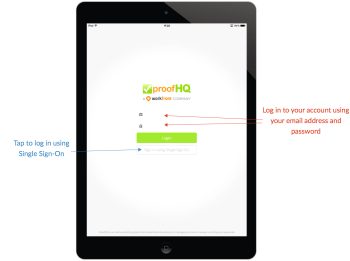
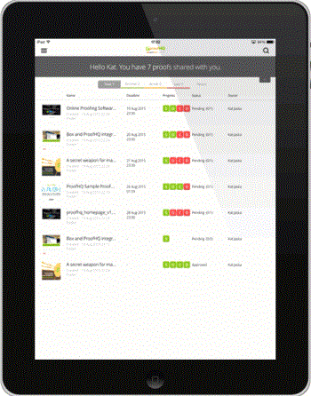
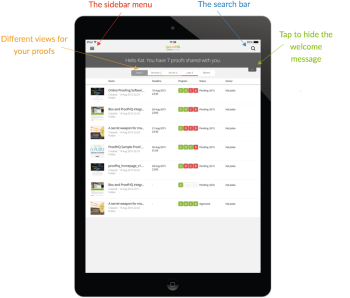
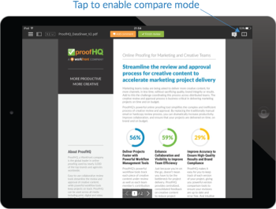
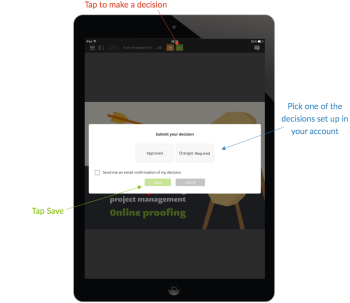

# Workfront Proof mobile app for tablets

>[!IMPORTANT]
>
>This article refers to functionality in the standalone product Workfront Proof. For information on proofing inside Adobe Workfront, see [Proofing](../../../review-and-approve-work/proofing/proofing.md).

The Workfront Proof tablet&nbsp;app lets you conveniently review and approve your proofs when you’re on the go. The app is available for download for everyone, you don’t have to be a Workfront Proof user to be able to review proofs on your tablet or your phone.

Guests can simply click the Go to proof button in the email notification they receive to open the proof in the app.

Workfront Proof users can log in to the app and use the dashboard to conveniently manage their work.

## Device requirements

* iOS devices: iPad 3, iPad air, iPad mini
* Android devices: Android OS version&nbsp;4.4+, 5+; Samsung Galaxy Tab 3+ (10.1")

This is an app built specifically for tablets. If you'd like to use Workfront Proof on your iPhone, download the iOS app from the iTunes Store.

## Download the app

The Workfront Proof tablet&nbsp;app is available in the Apple App Store and the Google Play Store.

<ol> 
 <li value="1"> 
Click the link below to download the app and install it on your device.
 
  
 
    
 </li> 
</ol>

## Log in

The Workfront Proof tablet&nbsp;app gives you access to the dashboard with the proofs that need your attention. To access the dashboard:

<ol> 
 <li value="1">Do one of the following: 
  <ul> 
   <li>
Log in using your Workfront Proof credentials. 

If you get a proof invitation email and open in on your mobile device, the link will take you to the proof in the app. You don’t have to be a user to be able to review proofs; however, you do have to have the app installed on your device to be able to view them.
</li> 
   <li>
If Single Sign-On is enabled in your account, tap that option on the login screen. 

You will be taken to the login page that will ask you for your email address. After typing your email address, you will be redirected to your Identity Provider’s page where you will be able to log in using your password.

 
</li> 
  </ul></li> 
</ol>

## The Dashboard

If you&nbsp;would like to stay logged in to your Workfront Proof account:

1. Enable `Keep me logged in` in the sidebar menu under `Settings`:

The *Dashboard* link will take you back to the dashboard from any view in the app. You can also use it to reload the dashboard.

Other elements of the dashboard are the search bar that lets you search the account by the proof name and different views that help you effectively manage your workload.

## Manage your workload using Dashboard views

Similarly to the dashboard charts in our web application, in the mobile app we display a list of proofs that were shared with you. The welcome message at the top of the page will give you the total number of the proofs and below that we break them down into *On time*, *At risk,* and *Late proofs*.

* `On time proofs` are the proofs that either do not have a deadline set or the deadline is&nbsp;out by more than 24 hours.
* `At risk proofs` are the ones where the deadline is within the next 24 hours - the progress bar is orange for these proofs.
* `Late proofs` are the proofs that are already past the deadline - the progress bar is red for these proofs. Upon reaching the deadline Workfront Proof sends the late decision makers and the proof owner an automated reminder email.

These proofs are grouped into separate views, allowing you to conveniently prioritize your work, starting from the proofs that are already past the deadline.

Another view that you may find useful is the *Recent* view - it shows you the proofs you recently accessed in the app, so if you’d like to see the same proof again, you can easily find it on that list.

## Review proofs in the app

<ol> 
 <li value="1"> 
Click the proof's name to open in the Workfront Proof Viewer.
 
Or
 
To open a proof from an email notification, reviewers can click on the Go to proof link in the notification.  If you have a Workfront Proof account, you can log in and access your proof from the dashboard.
 <note type="note">
    &nbsp;You must have the app installed on your device to be able to review proofs in Workfront Proof, even if you don’t have a Workfront Proof account.
    
  </note> 
When you open a proof for the first time, we will show you a tour helping you get started with reviewing proofs in the app.
 
  
 </li> 
 <li value="2">Navigate in your proof: 
  <ul> 
   <li>
To jump to a specific page of the proof, swipe sideways or use the thumbnails list.

You can also use the arrows at the bottom of the page or put in a specific page number.
</li> 
   <li>To go to a different version of the proof, use the version drop-down menu at the top of the page.</li> 
   <li>To zoom in, pinch the screen.</li> 
   <li>
To pan, press and hold and move the image around until you find the right position.

 

Reviewing proofs in the mobile app is as simple as reviewing proofs using the Workfront Proof Viewer. Below we will take a closer look at adding comments and markups, managing feedback and making decisions. We will also discuss different options available in the sidebar of the app.
</li> 
  </ul></li> 
</ol>

## Comment in the app

The video below shows you the basics of commenting in the mobile app. It shows how to make a comment, how to post a reply to a comment, how to use different markups and delete them, and how to edit and delete comments.

You can edit and delete only comments if no reply has been posted. If you don’t see the trash icon, it&nbsp;is possible that this option was disabled by your Workfront Proof administrator.

There are three comment viewing options in the app. You can switch between them by clicking on the comment button.

* `List view`&nbsp;displays a list of all comments. You browse them either by tapping on each comment or by tapping on the up and down arrows.&nbsp;
* `Single comment view` displays one comment at a time. To go to the next comment, tap the arrow at the top of the page.
* `Hide comments`  `view` hides all comments.

Every markup left on the proof drops a pin on the image. To view the comment and markup associated with the pin, simply tap the pin. You can do that only if the comment editing box is closed. To close the comment box, tap the x in the top left comment of the box.

## Text annotation tool

Proofing text on the go is really in the Workfront Proof tablet app. The text annotation tool is available in the markups toolbar after you click on the orange&nbsp;Add comment button.

<ol> 
 <li value="1">Select the tool and then tap on the word you want to highlight.</li> 
 <li value="2"> 
Hold your finger on the word until highlight becomes available and use the sliders to highlight the whole word or phrase you want to markup.
 
The text tool has four options to choose from:
 
  <table cellspacing="0"> 
   <col> 
   <col> 
   <tbody> 
    <tr> 
     <td role="rowheader">Highlight </td> 
     <td>Highlights the text and copies it into the comment box.</td> 
    </tr> 
    <tr> 
     <td role="rowheader">Replace </td> 
     <td>Adds [REPLACE] and [WITH] into the comment box together with the text, making it easier for you to recommend replacement text.</td> 
    </tr> 
    <tr> 
     <td role="rowheader">Delete </td> 
     <td>Strikes through the text and adds [DELETE] to the comment box.</td> 
    </tr> 
    <tr> 
     <td role="rowheader">Insert after </td> 
     <td>Adds [INSERT AFTER] into the comment box.</td> 
    </tr> 
   </tbody> 
  </table> </li> 
 <li value="3"> 
(Optional)To paste text from another document you have saved on your tablet, tap and holding your finger on the comment box until you see an option to paste the text copied from the document.
 
&nbsp;
 </li> 
</ol>

## Manage comments in the mobile app

After everyone has left their comments and markups on the proof, very often the proof manager needs to go through the feedback and decide which changes should be applied to the next version of the proof. In Workfront Proof you can use Actions on comments to flag each individual comment and mark the ones that should be actioned.

Actions on comments needs to be set up in your account by the Workfront Proof administrator and can only be used on a proof by people who have edit rights.

When you are working on preparing the next version of your proof, you can check off comments as you go. The comment is marked as resolved with a green check mark. If you need to reopen the comment, you can click on the arrow at the bottom of the comment box.

If you would like to prevent other reviewers from responding to a comment thread, you can lock it. To be able to do that, you need to have edit rights on the proof. Locking the comment thread is very simple, all you have to do is tap on the padlock icon at the bottom of the comment box.

## Reviewing video proofs

Reviewing video on the go is easy with the Workfront Proof tablet app. The video below shows you how to make comments, markups, and decisions in the app.

## Compare mode

The compare mode in the tablet app allows you to easily compare two different versions of a proof or two proofs from the same folder.

>[!NOTE]
>
>Due to the limitations of iOS, comparing two videos is not available on iPads. It is available on tablets with Android operating systems.

The compare mode is available in the top right corner of the screen.

The compare tool displays the two most recent versions of the proof.

<ol> 
 <li value="1">To change the versions you want to compare, use the version drop-downs at the top of the page.</li> 
 <li value="2"> 
To select a different proof from the same folder, use the folder browser (the folder icon available at the top of the page).
 
      The compare tool gives you the ability to compare versions side by side to check if the&nbsp;requested changes were made. If you unlock the navigation, you will be able to compare different pages of both versions.
 
  
 
Now you are able to compare different pages of the proofs you are looking at. You can also compare different pages of the same proof, which can be helpful if you're checking your proofs for messaging and branding consistency.
 
  
 </li> 
</ol>

## Make decisions in the app

<ol> 
 <li value="1"> 
Tap the green decision button at the top of the page. 
 
  
 
If you don’t see the green Finish review button and you think you should make a decision on the proof, your Workfront Proof administrator can update your proof role, as explained in <a href="../../../workfront-proof/wp-work-proofsfiles/share-proofs-and-files/manage-proof-roles.md" class="MCXref xref">Manage Proof Roles in Workfront Proof</a>.
 </li> 
</ol>

## The proofing viewer sidebar

The sidebar contains a lot of useful features and functionalities. Depending on your permissions on the proof, you may not see all of them. Below all of them are discussed in more detail.

| Dashboard |Takes you back to the mobile app dashboard. |
|---|---|
| Workflow |Shows you the details of the review stages, together with a list of reviewers, their deadlines, progress bars, decisions and the number of comments and replies. |
| `Details`  |Shows you information about the proof, additional sharing options and the activity audit trail. |
| `Share`  |Displays the Proof URL and the Embed code. |
| `Notifications`  |Lets you update your email alerts on the proof you’re currently reviewing. This doesn’t alter your default settings. |
| `Lock`  |Lets you lock the proof. You need to have edit rights on the proof to be able to see this option. |
| `Delete`  |Moves the proof to the Trash folder. You need to have edit rights on the proof to be able to delete it. |
| `Settings`  |You can decide to show pins and/or markups on the proof, you can also enable Keep me logged in to prevent you from getting logged out of the app. |
| `Help`  |Lets you bring up the app tour again. |
| `Log out`  |Logs you out from the app and your account. |

