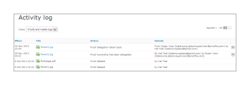

# Understanding the *Workfront Proof* Activity Audit Trail

>[!IMPORTANT]
>
>This article refers to functionality in the standalone product *Workfront Proof*. For information on proofing inside *Adobe Workfront*, see [Proofing](../../../review-and-approve-work/proofing/proofing.md).

The Activity Audit Trail page provides you with a complete list of all activity that has taken&nbsp;place in your account.

To access the Activity page:

<ol> 
 <li value="1">In the left sidebar, click Activity.  The Activity Audit Trail page displays. </li> 
 <li value="2">In the View drop-down menu, select the view you want to display. You can choose from the following views:  
  <ul>
   <li>Proofs and media logs: Displays&nbsp;all the activity on <em>proofs</em> and files in your account.</li>
   <li>Folders logs: Displays all the activity on folders in your account.</li>
   <li>Profile log: Displays all the changes that have been made in your personal profile.</li>
   <li>Account log: Displays all the changes in account settings. This view is available only to users with Administrator rights.</li>
   <li>Authentication log: Displays all the login activity on the account, showing both successful and unsuccessful attempts.</li>
   <li>Billing log: Displays the billing history on your account. This view is available only to users with Billing Administrator rights.</li>
   <li>Email log: Displays all the emails sent from your account.&nbsp;</li>
  </ul></li> 
</ol>

