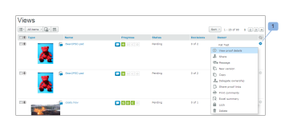
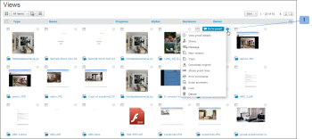

# Page Layout on the Views Tab in Workfront Proof

>[!IMPORTANT]
>
>This article refers to functionality in the standalone product Workfront Proof. For information on proofing inside Adobe Workfront, see [Proofing](../../../review-and-approve-work/proofing/proofing.md).

You can adjust the page layout on the Views tab. The following layout options are available:

## List

<ul> 
 <li>Shows proof or file name plus standard view columns</li> 
 <li> 
The proof actions menu is located at the right hand side of the line (1)
 
  
 </li> 
</ul>

##  Thumbnail List

<ul> 
 <li>Shows proof image/file icon, proof or file name plus standard view columns</li> 
 <li>The proof actions menu is located at the right-hand side of the line (1)</li> 
 <li> 
Note that this is the default standard view.
 
  
 </li> 
</ul>

## Thumbnails

<ul> 
 <li>Shows proof image/file icon and proof/file name only</li> 
 <li> 
The proof actions menu is located at the top right corner for each proof (1)
 
  
 </li> 
</ul>

##  Changing Your Page Layout

To change the page layout on your dashboard or trash page, choose your preferred view by clicking one of the view buttons at the top of the page:

To change the page layout on all other views pages in your account, expand the drop-down menu at the top of the page and click on your preferred page layout:

