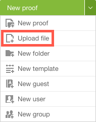

# Upload Files and Web Content to *Workfront Proof*

>[!IMPORTANT]
>
>This article refers to functionality in the standalone product *Workfront Proof*. For information on proofing inside *Adobe Workfront*, see [Proofing](../../../review-and-approve-work/proofing/proofing.md).

You can upload files to *Workfront Proof* without creating a *proof*. You can also add URLs for websites and other web content to *Workfront* Proof.

## About Uploading a File Without Creating a Proof

In some cases, you may want to add a file to *Workfront Proof* and create a *proof* for it simultaneously (see [Generate Proofs in Workfront Proof](../../../workfront-proof/wp-work-proofsfiles/create-proofs-and-files/generate-proofs.md)).

In other cases, you may want to add a file to *Workfront Proof* without creating a *proof*.

This is useful, for example, if you do not have *proofing* rights but you need to provide a file for review to users who do have *proofing* rights; one of those users can create the proof after you have uploaded it.

Also, you can use *Workfront Proof* as cloud storage for files without creating *proofs* for them. Some organizations use *Workfront* Proof to keep all digital materials for a project together, even when some of them, such as internal documents about the project, do not need to be proofed.

## Uploading Files and Adding URLs

To upload a file to *Workfront Proof*:

<ol> 
 <li value="1">In the upper-left corner of <em>Workfront Proof</em>, click the down arrow on the New <em>proof</em> button, then click Upload file in the menu that appears. </li> 
 <li value="2">The New File page appears.</li> 
 <li value="3">Do one of the following to upload or add the content you need to <em>proof</em>: 
  <ul> 
   <li>Drag and drop the file or files into the Drop files here box. Or&nbsp;click Select files, then find and&nbsp;select them. </li> 
   
You can repeat this step to add as many files as you want. The files you upload will appear as individual files in your account, rather than one merged file.
 
  </ul> 
  <ul> 
   <li>If you are creating a file from a URL, type the URL in the box containing&nbsp;www.yoursite.com. When you are finished,&nbsp;press Enter or click the green arrow button at the end of the box. You can create multiple files all at once by typing multiple URLs separated by spaces.</li> 
  </ul></li> 
 <li value="4">Type the email address of the reviewers who need to <em>proof</em> the files in the box below Share. When you complete these steps, these recipients will receive an email containing the download links for the files. You can share the files with contacts, groups, and partners (see <a href="https://support.workfront.com/hc/en-us/sections/115000920808-Contacts">Contacts,</a>&nbsp;<a href="https://support.workfront.com/hc/en-us/sections/115000920828-Groups">Groups,</a>&nbsp;and <a href="https://support.workfront.com/hc/en-us/sections/115000912107-Partner-accounts">Partner Accounts</a>).&nbsp;</li> 
 <li value="5">(Optional) You can select Notify people by email if you want to add a custom subject and message to the email received by the recipients of the files.&nbsp;See <a href="../../../workfront-proof/wp-work-proofsfiles/share-proofs-and-files/share-files.md" class="MCXref xref" xrefformat="{para}">Share Files in Workfront Proof</a>&nbsp;for more information.</li> 
 <li value="6">(Optional) Under Organize, you can select or create a folder to organize the files you are uploading.&nbsp;You can also add tags to easily identify and find the files. </li> 
 
Tags are simply words&nbsp;or combinations of words that you can use to describe the content of a file. They make it easier to search for what you need. <note type="note">
   &nbsp;Folders you add in 
   <em>Workfront Proof</em> are part of the 
   <em>proofing</em> system only; they are not part of the file folder system you access on your computer or on your company's servers.&nbsp;
  </note>
 
 <li value="7">Click Save.&nbsp;</li> 
</ol>

