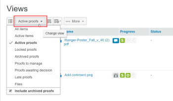
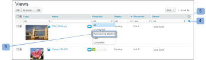

# Manage Items on the Views Page in `Workfront Proof`

>[!IMPORTANT]
>
>This article refers to functionality in the standalone product `Workfront Proof`. For information on proofing inside `Adobe Workfront`, see [Proofing](../../../review-and-approve-work/proofing/proofing.md).

The Views page allows you to see and work with all of your `proofs`, files and folders in one place.

## Displaying the Views Page

1. Click `Views` in the left sidebar.
1. From the drop-down menu (2), click the view (3) you want to see.

## Changing the Views Page Layout

The default Views page layout is the Thumbnail list. In this layout, you can see a miniature image of each `proof`, file (if possible to generate), and folders (if set), with other details included in separate columns.

1. Click the `Page Layout` icon (1), then choose the layout you want.

 

## Changing the Views List

To change what you see in the Views list:

<ol> 
 <li value="1">Click the&nbsp;Change view button. The name appearing on this button depends on the view you selected the last time you used it. </li> 
 <li value="2">Click a different view in the drop-down menu: 
  <ul>
   <li>All items: Includes all proofs, files and folders that you have permission to see. It is the default when you open the Views page. You have the option to include/exclude archived proofs in this view.</li>
   <li>Active items: All active proofs, files and folders.</li>
   <li>Active proofs: All active (not archived) proofs that you have permission to see.</li>
   <li>Locked proofs: Only locked proofs.</li>
   <li>Archived proofs: Only archived proofs (see <a href="../../../workfront-proof/wp-work-proofsfiles/organize-your-work/archive.md" class="MCXref xref">Archive in Workfront Proof</a>).</li>
   <li>My Proofs: Shows only proofs for which you are the owner and that are delegated to you. For more information, see&nbsp;<a href="../../../workfront-proof/wp-getstarted/personal-settings/designate-temp-proof-owners.md" class="MCXref xref">Designating Temporary Proof Owners in Workfront Proof</a>.</li>
   <li>Proofs awaiting decision: Shows only proofs on which you have to make a decision&nbsp;</li>
   <li>Late proofs: Shows only proofs for which the deadline has passed</li>
   <li>Files: Shows only files</li>
  </ul> In each of these views, the following columns are included 
  <ul>
   <li>Type: Icon of the item with the icon of proof, file or folder</li>
   <li>Name: Name of the proof, file or folder</li>
   <li>Progress: S=Sent, O=Opened, C=Comment, D=Decision (see Progress Bar)</li>
   <li>Status: Pending, Changes required, Approved</li>
   <li>Decisions: Number of decisions made and number required</li>
   <li>Owner: Name of the person who owns the proof My proofs, Proofs awaiting decision and Late proofs views have an additional column called My deadline. This column displays your own deadlines on the proofs where you are explicitly added as a Reviewer/Approver. <note type="note">
     &nbsp;If you navigate away from the Views page and return to it later in the same session, your last selected view appears.
      
    </note>You can also create your own views. See&nbsp;<a href="../../../workfront-proof/wp-work-proofsfiles/manage-your-work/create-and-manage-custom-views.md" class="MCXref xref">Create and Manage Custom Views in Workfront Proof Proof</a> for more information. </li>
  </ul></li> 
</ol>

## Filtering Items

You can filter the information listed in a view.

<ol> 
 <ol> 
  <li value="1">Click the Show filters&nbsp;icon at the right top of the page (1). </li> 
  <li value="2">The filter bar (2) appears and each category has a filtering drop-down menu (3) to select your preferred value. The default value for each category is All. </li> <note type="note">
   &nbsp;The filter bar does not display in custom views you create. For those views,&nbsp;you can apply and edit filters in the Filters tab. For more information, see 
   <a href="../../../workfront-proof/wp-work-proofsfiles/manage-your-work/create-and-manage-custom-views.md" class="MCXref xref">Create and Manage Custom Views in Workfront Proof Proof</a>.
  </note> 
  <li value="3">To apply all chosen filters, click the Filter icon (4) at the end of the filtering bar. </li> 
 </ol> 
</ol>

The Filter values you select remain in effect until you change them. If you want to see and access the full list of items again, you must change all the filter values back to the default, which is `All`.

>[!NOTE]
>
>&nbsp;If you set filtering options and then hide the filtering bar by clicking the Hide filters icon (5), the bar automatically shows again if you change views. If you hide the filtering bar while all filters are set to the default all option, the filtering bar remains hidden when changing views.

## Sorting Items

When you create a new `proof` (or version) or upload a new file, it appears at the top of your All items list. The oldest item appears at the bottom of the list.&nbsp;

To view the list in a different sort order:

<ol> 
 <li value="1">Do one of the following: 
  <ul>
   <li>Click one of the column headings in the list: Type, Name, Status, Decisions, or Owner.  For example, if you want to see the proofs/files in alphabetical order, click the Name heading once (1) to sort the list by name in ascending order (A - Z). You can click the Proof name heading again (2) to reverse the order and display the proofs in descending order (Z - A).</li>
   <li>Click the down arrow in the upper-right of the Views page to sort by the creation date (Latest or Oldest) or by Type, Name, Status, Decisions, or Owner.  If your column is sorted in ascending order the column header will show an upward arrow next to the column name. To reverse the order (to descending) click the relevant column header (this will show a downward arrow next to the column name). </li><note type="note">
    &nbsp;Changes that you make to the sort order of the items last only while you remain on the All items page. If you navigate away from the All items page and return to it later, the items are listed again in the default reverse chronological order.
   </note>
  </ul></li> 
</ol>

## Viewing a Proof Summary

To view more detailed information about a `proof`:

<ol> 
 <li value="1">Click the arrow to the left of the proof image.  The arrow points down and the Proof summary displays below the basic information about the proof. The Proof summary shows: 
  <ul>
   <li>Proof summary: Overall status of the proof</li>
   <li>Stage: Indicates the proof deadline and number of decisions made and required</li>
   <li>Reviewers: Name, role and progress of each reviewer will be listed</li>
   <li>Versions: Version of the proof being viewed and the total number of versions available</li>
   <li>Folder: Folder in which the proof is located</li>
   <li>State: Active, Locked, Draft, or Submitted</li>
  </ul></li> 
 <li value="2">(Optional) If you have edit rights on the proof and the proof has stages, click the More (three dot) menu to the right of the stage to access the following options: 
  <ul>
   <li>Message all: Send an email to all reviewers on the stage.</li>
   <li>Share: Add new reviewers</li>
   <li>Delete stage</li>
  </ul></li> 
 <li value="3">(Optional) Click a reviewer's More (three dot) menu to the right of their name to do any of the following: 
  <ul>
   <li>Send the reviewer a reminder message.&nbsp;</li>
   <li>Edit the Reviewer's settings on the proof.  The Edit reviewer box that appears, you can change not only role and email alerts but also the Display Name for the Reviewer. Note that the Display Name can be changed only on the particular proof, not in the reviewer's details in the Contacts page. See <a href="https://support.workfront.com/hc/en-us/sections/115000920808-Contacts">Contacts</a> for more information.</li>
   <li>Select the reviewer to be the Primary Decision Maker on the proof.</li>
   <li>Delete the reviewer from the proof. </li><note type="note">
    &nbsp;You can also change the Role and Email alerts for a reviewer added to the 
    proof.
   </note>
  </ul></li> 
</ol>

## Including and Excluding Archived Proofs

The All Items view by default displays all active and locked `proofs`, files and folders. It also provides the option to include or exclude archived `proofs` in the view.   
To include the archived `proofs`:

<ol> 
 <li value="1">When you choose a view, click Include archived proofs.  Archived proofs will appear with an archived icon to distinguish them from other proofs. </li> 
</ol>

## Opening an Item From a List View

1. Do one of the following:

  * To view details about a `proof`, file or folder, click its name.
  * To open a `proof` into the `proofing viewer`, click `Go to Proof`.  
    For information about the `proofing viewer`, see [Review a proof](../../../review-and-approve-work/proofing/reviewing-proofs-within-workfront/review-a-proof/review-a-proof.md).

## Performing Actions on Multiple Items

To select multiple items:

<ol> 
 <li value="1">Click the checkbox above the list. </li> 
 <li value="2">In the extra options that appear above the Views list, do any of the following to the files you have selected: 
  <ul>
   <li>Click on Tags&nbsp;to add a tag to these items.</li>
   <li>Click on Move to to move the selected items to a different folder (or move the items out of the folder if you select (No folder selected).</li>
   <li>Click Share selected items&nbsp;to share all of these items with additional reviewers. </li>
   <li>Click Delete&nbsp;to move the selected items to the Trash. </li>
   <li>Click the More menu for additional actions available. </li><note type="note">
    The actions will be applied only to those of the selected items that have the particular option available. For example if you select files and 
    proofs and choose Lock, only the 
    proofs will be locked (because you cannot lock files)
   </note>
  </ul></li> 
</ol>

## Moving an Item to a Folder

If you have the edit rights to do so, you can move `proofs`, files and folders to specific folders on the Views page.&nbsp;

1. Open the folder tree in the sidebar by clicking the arrow to the left of your top-most folder.
1. Do one of the following:

  * To move one item, click and hold it, dragging and dropping it to the folder where you want to put it.
  * To move multiple items at the same time, you can select the check boxes to the left of the items, then click `Move to`&nbsp;above the list, then select the folder where you want to put them, or create a new folder for them.

