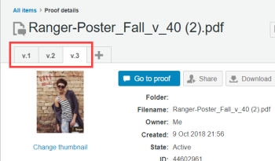

# Managing Proof Versions in *Workfront Proof*

>[!IMPORTANT]
>
>This article refers to functionality in the standalone product *Workfront Proof*. For information on proofing inside *Adobe Workfront*, see [Proofing](../../../review-and-approve-work/proofing/proofing.md).

Managing feedback across multiple versions or revisions of a piece of work can be a huge challenge. *Workfront Proof* simplifies this process by letting you create and compare multiple versions of a *proof*.

There is no limit to the number of versions of a *proof* you can create. So, if you need to go through many revisions with a client to get a final approval, all the versions created can be viewed and easily managed within *Workfront Proof*.&nbsp;

Permissions are specific to a version, so you can give a person permission to see one version but not another. Conversely, if you share a later version with a person, they will not be able to see earlier versions unless you go back and explicitly add them to those previous versions as well.

To create a new version of a *proof* you must have edit rights on the *proof*.

Please see [Manage Proof Roles in Workfront Proof](../../../workfront-proof/wp-work-proofsfiles/share-proofs-and-files/manage-proof-roles.md) and [Managing Proof Versions in Workfront Proof](#) to get more information on who has edit rights on a *proof*. See&nbsp; to find out more about creating versions.

## Viewing Proof Versions in the *proofing viewer*

The full name of the version you are viewing displays at the top left of the *proofing* viewer. Any other versions of the proof will show as version numbers only.

<ol> 
 <li value="1">Open a <em>proof</em> in the <em>proofing</em> viewer, as described in <a href="../../../workfront-proof/wp-work-proofsfiles/review-proofs-wpv/open-proof.md" class="MCXref xref">Opening a Proof in Workfront Proof</a>.</li> 
 <li value="2">In the <em>proofing</em> viewer, click the version number to the right of the proof name.</li> 
 <li value="3">To view the other version, click its name in the menu that appears when you click the version number.</li> 
 <li value="4">To compare two versions, click the Compare <em>proofs</em> icon.  If there are multiple versions of the <em>proof</em>, you can select which two version you want to compare by clicking the relevant version number in each side of the compare mode split screen.</li> 
</ol>

For information about reviewing *proofs* in a *proofing* viewer, see [Review a proof](../../../review-and-approve-work/proofing/reviewing-proofs-within-workfront/review-a-proof/review-a-proof.md).

## Accessing Proof Versions via the Proof Details Page

You can access all versions of a *proof* via the Proof details page.&nbsp;

<ol> 
 <li value="1">Open the Proof details page for a <em>proof</em>, as described in <a href="../../../workfront-proof/wp-work-proofsfiles/manage-your-work/manage-proof-details.md" class="MCXref xref">Manage Proof Details in Workfront Proof</a>.</li> 
 <li value="2">Click the tab for the version tabs at the top of the page and click Go to <em>proof</em> to open the version you want in the <em>proofing</em> viewer. </li> 
</ol>

## Linking Proof Versions

If your *proof* has multiple versions, the previous version of the *proof* is commonly known as the parent *proof*.

If you would like to change the parent *proof* (previous version) to another *proof* in your account, or connect a single *proof* to another *proof* in your account (as a new version of the other *proof*), you can do so easily by following these steps:

1. Open the Proof details page for a *proof*, as described in [Manage Proof Details in Workfront Proof](../../../workfront-proof/wp-work-proofsfiles/manage-your-work/manage-proof-details.md).

1. Click `More` > `Change previous version`.

1. In the `Change previous version`box that appears, select the *proof* you wish to set as the parent *proof* (previous version).  
   If you need help finding the *proof* on the list you can sort the columns by clicking on the column header.

1. Click `Change previous version` at the bottom of the box to connect versions.&nbsp;

>[!NOTE]
>
>&nbsp;When you connect a *proof* to another *proof* in your account (as a new version), *Workfront Proof* locks the *proof* that is now the previous version.

## Unlinking Proof Versions

You can unlink the *proof* you're currently viewing from its parent *proof* (previous version) without linking it to another *proof* in your account:

<ol> 
 <li value="1">Open the Proof details page for a <em>proof</em>, as described in <a href="../../../workfront-proof/wp-work-proofsfiles/manage-your-work/manage-proof-details.md" class="MCXref xref">Manage Proof Details in Workfront Proof</a>.</li> 
 <li value="2">Click More > Remove link to previous version.</li> <note type="note"> 
  <ul> 
   <li>Only the last version can be unlinked (disconnected) from the whole set of versions. It will then become a single <em>proof</em>. </li> 
   <li>If you need to insert a version in between two existing versions, you can unlink all versions of the same <em>proof</em> and re-link them in the correct order. </li> 
  </ul> 
 </note> 
</ol>

## About Version Sets and Proof Limits

Each set of five versions will count as one *proof* against your total *proof* limit.

For example, if you upload five versions of a design (including the original version), that counts as one *proof*. If you upload six versions of a design, that counts as two *proofs*. Eleven versions would count as three *proofs* and so on.

For audio visual files, each new version counts as a new *proof*.
