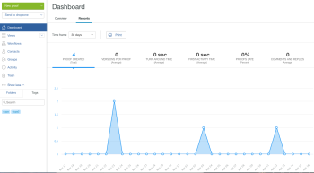

# Run Reports in Workfront Proof

>[!IMPORTANT]
>
>This article refers to functionality in the standalone product Workfront Proof. For information on proofing inside Adobe Workfront, see [Proofing](../../../review-and-approve-work/proofing/proofing.md).

Workfront Proof enables you to view reports&nbsp;so you can track the work progress and efficiencies of your teams.

You can easily view the number of&nbsp;proofs that were&nbsp;created in your Workfront Proof account, how many versions are associated with each proof, the turnaround time, and more.

## Prerequisites

Whether reports&nbsp;are available depends on your type of Workfront Proof account and user permission levels.

* [Account Prerequisites](#account-prerequisites) 
* [User Prerequisites](#user-prerequisites)

### Account Prerequisites

Reporting&nbsp;information is available only with Premium plans.

<!--
If you want to know more, contact your Account Manager.
-->

### User Prerequisites

Reporting&nbsp;information is available only to users with full access to all proofs on your account (i.e. users with at least [Proof Permissions Profiles in Workfront Proof](../../../workfront-proof/wp-acct-admin/account-settings/proof-perm-profiles-in-wp.md)).

In this panel you can

* Control the time span of the displayed data
* Analyze changes in metrics over time
* Check the details of a selected point in time by hovering over it
* Check the total number of proofs created in your selected time span
* Check the average number of versions included in the completed sets of proofs

## Viewing Reports

<ol> 
 <li value="1">Go to the Dashboards page.</li> 
 <li value="2">Click the Reports tab. </li> 
 <li value="3">In the Time frame drop-down menu, select&nbsp;whether you want to display information about proofs created within the past 24 hours, 7 days, 30 days, 90 days, or a custom time period. If you select a custom time period, select the start and end dates, then click Apply. The following information is displayed for the time period you selected: Proof Created:&nbsp;Number of proofs created within the selected time period. Versions Per Proof:&nbsp;Average number of versions per proof for all completed proofs (Approved or Approved with Changes) within the selected time period. Turn Around Time:&nbsp;Average time from when the first version was created to the time the decision was made on the final version. First Activity Time:&nbsp;Average time from when the proof was created to the time of the first activity on the proof. Proofs Late:&nbsp;Average percentage of completed proofs (Approved or Approved with Changes) that had at least one version that was late within the selected time period. Comments and Replies:&nbsp;Average number of comments and replies that were made on all proofs within the selected time period.</li> 
 <li value="4">(Optional) Select or deselect the Show min-max range option to determine whether minimum and maximum values are displayed in the graph.  When this option is selected, blue shading is displayed between the minimum and maximum recorded values.</li> 
 <li value="5">(Optional) You can filter the data that is displayed, as described in <a href="#filtering-reports" class="MCXref xref">Filtering Reports</a>.</li> 
</ol>

## Filtering Reports

By default, data displayed in reports&nbsp;includes all information from your Workfront Proof system. You can use filters to show only information that is relevant to your needs.

To filter reporting information:&nbsp;

<ol> 
 <li value="1">Go to the Dashboards page.</li> 
 <li value="2">Click the Reports tab. </li> 
 <li value="3">Run a report, as described in <a href="#viewing-reports" class="MCXref xref">Viewing Reports</a>.</li> 
 <li value="4">Click Filter. </li> 
 <li value="5">On the left side of the page, select from the following filter options: Proof Type: Select the type of proofs you want to be included in the report. Decisions: Select options to determine whether only proofs that contain&nbsp;certain decisions have been made.  Recipients:&nbsp;Select individual users to view information relating to proofs shared with the&nbsp;selected users.  Proof Owners: Select individual users to view information relating to proofs owned&nbsp;by the&nbsp;selected users. Proof Creators:&nbsp;Select individual users to view information relating to proofs created by the&nbsp;selected users. Accounts: Select which accounts&nbsp;you want to include in the report.</li> 
 <li value="6">Click Apply.</li> 
 <li value="7">(Optional) Select or deselect the Show min-max range option to determine whether minimum and maximum values are displayed in the graph.  When this option is selected, blue shading is displayed between the minimum and maximum recorded values.</li> 
</ol>

## Printing Reports

<ol> 
 <li value="1">Go to the Dashboards page.</li> 
 <li value="2">Click the Reports tab, then click Print. </li> 
 <li value="3">Select from the various printing options available. The printing options vary depending on&nbsp;the&nbsp;browser&nbsp;and browser version you use.</li> 
</ol>

