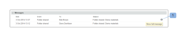

# Manage Folders and their Contents in Workfront Proof

>[!IMPORTANT]
>
>This article refers to functionality in the standalone product Workfront Proof. For information on proofing inside Adobe Workfront, see [Proofing](../../../review-and-approve-work/proofing/proofing.md).

One of the benefits of organizing your projects and proofs into folders is the ability to manage them on the Folder details page. This page is a control center for your project, from here you can conveniently manage individual proofs and files as well as perform bulk actions.

## Grouping Items So Reviewers Can Work On Them Together

You can use folders to group proofs that you want reviewers to work on together. When a reviewer opens one of the proofs in the folder to launch the proofing viewer, all the other proofs in the folder are available—the reviewer can work on any proof in the folder without leaving the proofing viewer. For more information, see [Work with multiple proofs in the proofing viewer](../../../workfront-proof/wp-work-proofsfiles/review-proofs-wpv/work-with-multiple-proofs.md).

## Adding New Items to a Folder

When you are creating a proof or uploading a file, you can select the folder where you want to store it in the Organize section on the&nbsp;New proof page or the&nbsp;New file page.

For more information, see [Generate Proofs in Workfront Proof](../../../workfront-proof/wp-work-proofsfiles/create-proofs-and-files/generate-proofs.md) or [Upload Files and Web Content to Workfront Proof](../../../workfront-proof/wp-work-proofsfiles/create-proofs-and-files/upload-files-web-content.md).

>[!NOTE]
>
>&nbsp;If you are currently viewing the folder to which you would like to add a new item, that folder appears automatically in the Organize section when you open the New proof page or the New file page.

## Adding Existing Items to a Folder

You can add an existing file or proof to a folder.&nbsp;

For more information, see [Manage Files in Workfront Proof](../../../workfront-proof/wp-work-proofsfiles/manage-your-work/manage-files.md)&nbsp;or [Manage Proof Details in Workfront Proof](../../../workfront-proof/wp-work-proofsfiles/manage-your-work/manage-proof-details.md).

<ol> 
 <li value="1">(Conditional) Do one of the following: 
  <ul>
   <li>If you are adding a proof to a folder, go to the Proof details page as described in <a href="../../../workfront-proof/wp-work-proofsfiles/manage-your-work/manage-proof-details.md" class="MCXref xref">Manage Proof Details in Workfront Proof</a></li>
   <li>If you are adding a file to a folder, go to the File details page as described in <a href="../../../workfront-proof/wp-work-proofsfiles/manage-your-work/manage-files.md" class="MCXref xref">Manage Files in Workfront Proof</a>."</li>
  </ul></li> 
 <li value="2">Click the name of the Folder where the file or proof is located, then click the name of the folder where you want to move it. </li> 
</ol>

## Moving Items Out of a Folder

<ol> 
 <li value="1">(Conditional) Do one of the following: 
  <ul>
   <li>If you are moving a proof out of a folder, go to the Proof details page as described in <a href="../../../workfront-proof/wp-work-proofsfiles/manage-your-work/manage-proof-details.md" class="MCXref xref">Manage Proof Details in Workfront Proof</a>  Or If you are moving a file out of a folder, go to the File details page as described in <a href="../../../workfront-proof/wp-work-proofsfiles/manage-your-work/manage-files.md" class="MCXref xref">Manage Files in Workfront Proof</a>."</li>
  </ul></li> 
 <li value="2">Click the name of the Folder where the file or proof is located, then click Move to > (No folder selected). </li> 
</ol>

## Managing A Folder and Its Items on the Folder Details Page

You can easily manage your files from the Folder details page.

>[!NOTE]
>
>&nbsp;If you are not the creator or owner of the file, the options available will depend on your user [Proof Permissions Profiles in Workfront Proof](../../../workfront-proof/wp-acct-admin/account-settings/proof-perm-profiles-in-wp.md).

<ol> 
 <li value="1">On the Folders tab in the left navigation menu, click any folder to open the Folder details page.</li> <note type="note">
  If the folder contains only archived proofs, a message displays in yellow at the top of the page. If you click the link in the message, the folder view changes&nbsp;to the Archived proofs view. 
 </note> 
 <li value="2">Click&nbsp;Folder details, then do any of the following with the folder using the options that appear: 
  <ul>
   <li>Add or change the thumbnail image for the folder.</li>
   <li>View or edit the Description, Parent folder, Owner, Client, or Project&nbsp;associated with the folder.</li>
   <li>Make the folder Private.</li>
   <li>See when the folder was Created.</li>
   <li>See the name of the folder's Creator.</li>
  </ul></li> 
 <li value="3">(Optional)To change information associated with an item in the folder, click the More icon to the right of the item, then use any of the options that appear.  The options that appear depend on whether the item is a proof or a file. 
  <ul>
   <li>View proof details or View file details: Opens the Proof details or File details page. For more information, see <a href="../../../workfront-proof/wp-work-proofsfiles/manage-your-work/manage-files.md" class="MCXref xref">Manage Files in Workfront Proof</a>&nbsp;or&nbsp;<a href="../../../workfront-proof/wp-work-proofsfiles/manage-your-work/manage-proof-details.md" class="MCXref xref">Manage Proof Details in Workfront Proof</a>.</li>
   <li>Share: Lets you share the file with additional people. For more information, see <a href="../../../workfront-proof/wp-work-proofsfiles/share-proofs-and-files/share-files.md" class="MCXref xref">Share Files in Workfront Proof</a>.</li>
   <li>Message: Send an email to the people with whom the proof has been shared.</li>
   <li>New Version: Create a new version of the proof.</li>
   <li>Copy: Copy the proof with any proofing comments as a new version of an existing proof or as a new proof.</li>
   <li>Download original: Lets you download the original file. For more information, see <a href="../../../workfront-proof/wp-work-proofsfiles/manage-your-work/download-files-stored.md" class="MCXref xref">Download Files Stored in Workfront Proof</a>.</li>
   <li>Delegate ownership: Delegate ownership of the proof to another user.</li>
   <li>Share proof links: Send an email containing a link to the proof.</li>
   <li>Print comments: Print the comments reviewers have made on the proof.</li>
   <li>Excel summary: Create an Excel file containing the print summary for the proof.</li>
   <li>Lock: Lock the proof so no other users can open it.</li>
   <li>Delete: Deletes the file from Workfront Proof.</li>
  </ul></li> 
 <li value="4">(Optional) In the&nbsp;Shared with&nbsp;section, to send a reminder to a reviewer on the proof, click the&nbsp;More&nbsp;icon to the right of the user's name, then click&nbsp;Message. You can click&nbsp;Remove&nbsp;to unshare the folder with the person. Owners and creators of folders always appear on this list and are&nbsp;not be removable. If a user takes over the ownership of a folder, they automatically appear and are not be removable. You can share a folder with individual users and Partner companies. If the folder is shared with a Partner company, you can see the full list of recipients by clicking the information icon which appears when hovering over the row. For more information, see&nbsp;<a href="https://support.workfront.com/hc/en-us/sections/115000912107-Partner-accounts">Partner Accounts.</a></li> 
 <li value="5">(Optional) Edit the&nbsp;Manager's permissions on private folders by clicking on that person's line under Allow on folder, then specifying if you want the person to be able to create, edit and delete items from that folder.NOTE&nbsp;This option is available only for Managers from the same account as the folder owner who are added to private folders. Supervisors, Administrators and Billing Administrators have edit rights over all folders in the account and Observers cannot create any items. For information about permissions, see the&nbsp;<a href="../../../workfront-proof/wp-acct-admin/account-settings/proof-perm-profiles-in-wp.md" class="MCXref xref">Proof Permissions Profiles in Workfront Proof</a>.</li> 
 <li value="6">(Optional) Click&nbsp;Activity&nbsp;to view all actions performed in the folder in chronological order.</li> 
 <li value="7">(Optional) Click&nbsp;Messages&nbsp;section to view the messages that have been sent to users on the folder. When you hover over a message, you can click the i icon to the right to view the full message.  A pop up with the full email displays: </li> 
</ol>

## Managing Sub-Folders

You can manage the sub-folders from the Folders detail page.&nbsp;For more information, see [Manage Folders and their Contents in Workfront Proof](#).

<ol> 
 <li value="1">On the Folders tab in the left navigation menu, click the name of the parent folder that contains the sub-folder to open the Folder details page.</li> 
 <li value="2">Click the More menu to the right of the sub-folder. </li> 
 <li value="3">Click any of the following: 
  <ul>
   <li>View folder details:&nbsp;Opens the Folder details page.</li>
   <li>New proof: Lets you add a new proof to the sub-folder.</li>
   <li>Upload file:&nbsp;Lets you upload a file to the sub-folder.</li>
   <li>New sub-folder: Creates a new sub-folder inside the sub-folder.</li>
   <li>Share: Lets you share the sub-folder with other users.</li>
   <li>Excel summary: Lets you request an Excel summary of the sub-folder.</li>
   <li>Delete: Lets you delete the sub-folder.</li>
  </ul></li> 
</ol>

For more information, see [Manage Folders and their Contents in Workfront Proof](#).
