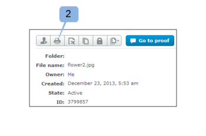
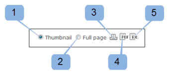

# Print and Export Comments in Workfront Proof

>[!IMPORTANT]
>
>This article refers to functionality in the standalone product Workfront Proof. For information on proofing inside Adobe Workfront, see [Proofing](../../../review-and-approve-work/proofing/proofing.md).

## Printing Comments

The Comments summary can be accessed directly from the following areas:

* [The Proof Viewer](#proof-viewer) 
* [The Proof Details Page](#proof-details) 
* [The Proof Actions Menu](#proof-actions-menu)

### The Proof Viewer

You can print the proof's Comments summary, including the thumbnails or full-view image of the proof, by clicking on the `Print` icon in the Proof Viewer. (1)

 

### The Proof Details Page

You can print the proof's Comment summary by clicking on the `Print` icon on the Proof details page. (2)

 

### The Proof Actions Menu

You can print the proof's Comment summary by clicking on the `Print` icon in the Proof actions menu.

To access the Comments Summary page from a list view:

1. Click on the `Actions` menu. (3)
1. Select `Print comments`. (4)

   
On the Comments summary page you have the following print options to choose from:

* Thumbnail view (1)
* Full page view (2)
* Print the page (3)
* Export the proof with comments to a PDF file (4)
* Export the proof comments to an Excel file (5)

 

### Thumbnail View

The Thumbnail view shows each comment in order, together with the full thread for each comment. You can also sort comments and see the thumbnail for each comment with markups added.

To print the thumbnail view click the `Printer` icon at the top-right corner of the page and select one of the following:

* Sort by comment ID or page (1)
* Thumbnail for each comment with markups added (2)

 

### Full-Page View

The full-page view shows each page in order, together with the comments on that page and a pin indicating where the markup for the comment is located on the page.

To print the full page view, click the `Printer` icon at the top-right corner of the page.
  
 

## Exporting an Excel Summary

To download the excel summary:

<ol> 
 <li value="1">Open the proof's actions menu to the right of the proof, then click Excel summary.&nbsp;(1) </li> 
</ol>

To download the excel summary from the Proof details page: 

<ol>
 <li value="1">Click the Export to Excel icon. (2)</li>
 

</ol>

## Exporting to PDF

To export a proof to PDF, together with all markups and comments, follow these steps:

1. Go to `Views` on the left side of the screen.
1. Click the `More` icon inline with a proof, then click `Print comments`.

1. Click the Export to PDF icon in the top-right corner of the page.

   When the PDF is ready, you will receive an email with a download link.

All comments will be shown in the PDF reader. If a comment has multiple markups associated with it, the comment will appear multiple times in the comments list (once for each markup).

>[!IMPORTANT]
>
>The&nbsp;Export to PDF function is available only for static files.

