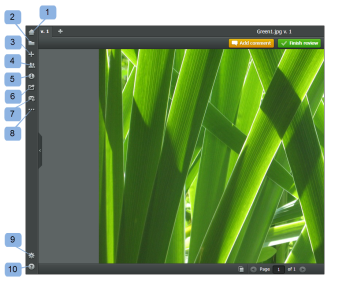

# Navigate the Legacy *proofing viewer*

>[!IMPORTANT]
>
>The information in this article refers to functionality that is currently deprecated and will be removed from *Adobe Workfront* in 2018.

## Using Zoom

You can zoom by clicking on the *proof* image and also by clicking and dragging to highlight a certain area of the *proof* to zoom in to. If you choose the latter method, the smaller the area highlighted the more it will zoom in.

When you open a *proof*

* The *proof* will open at 100% if this fits in the *proof* viewer

* Otherwise the *proof* will zoom until it fits the *proof* viewer but no further than 50%

When viewing comments

* The image will not zoom in automatically
* If the markup fits in the current zoom level, it won't zoom out
* If the markup fits in the current zoom level but is not in view, the *proof* image will pan to show the markup

## Using the Sidebar

In the sidebar inside you'll find many useful options and settings, including the *proof* details, grouped into a few sections:

<ul> 
 <li>Dashboard (1) - The Dashboard icon takes you directly to the Dashboard on your account. This icon is visible for <em>Workfront Proof</em> users only.</li> 
 <li>Folder browser (2 )The folder icon&nbsp;is visible to all reviewers one the <em>proof</em>, but only if the <em>proof</em> is placed in a&nbsp;folder.</li> <note type="note">
  If you don't have permissions to access the latest version of a particular 
  <em>proof</em> from this folder, you won't see this 
  <em>proof</em> listed in this view even though one of the previous versions has been shared with you. 
 </note> 
</ul>

* Create new items (3)&nbsp;
* Workflow (4)
* Details (5)
* Share (6)
* Email notifications (7)
* More (8)
* Settings (9)
* Help (10)

>[!NOTE]
>
>&nbsp;Some buttons&nbsp;in the sidebar are only visible to *Workfront Proof* users, as per their permissions on the *proof*.

