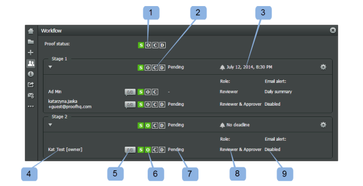

# Review a Workflow in the Legacy `proofing viewer` {#review-a-workflow-in-the-legacy-proofing-viewer}

>[!IMPORTANT] {type="important"}
>
>The information in this article refers to functionality that is currently deprecated and will be removed from `Workfront` in 2018.

This section displays the whole workflow of your `proof` as it is visible on the Proof Details page and in your email notifications. This panel is visible to all reviewers, both users and Guests.

Here you can do the following:

* Check the overall progress of the `proof` (1)
* Check the progress of each stage (2)
* Check the deadline for a stage (3)
* View the list of reviewers (4)
* Check the number of comments and replies each reviewer made on the `proof` (5)
* Check the progress of each reviewer (6)
* Check each reviewer's decision (7)
* Check the reviewer's `proof` role (8)
* Check the reviewer's email alert (9)

