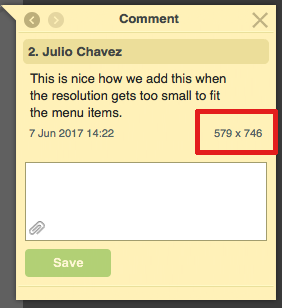
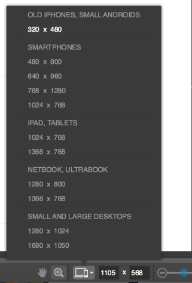

# View Interactive Proofs in Alternate Resolutions in the Legacy proofing viewer

>[!NOTE]
>
>The information in this article refers to functionality that is currently deprecated and will be removed from Adobe Workfront in 2018.

You can adjust the resolution that your content is displayed in for interactive proofs. This enables you to&nbsp;view how content will appear on different&nbsp;devices, such as various sizes of phones, tablets, and monitors.

When users comment on the proof, the current screen resolution is automatically displayed in&nbsp;the comment to ensure other users are aware what resolution the comment is associated with.

You can adjust the resolution of a proof through any of the following ways:

## Specifying&nbsp;a Custom Resolution

<ol> 
 <li value="1">Go to the Interactive proof for which you want to adjust the screen resolution.</li> 
 <li value="2">In the proofing viewer, next to&nbsp;the Resolution icon in the lower-right corner of the viewer, specify a custom resolution.  The Interactive proof is rendered in the selected resolution. The updated resolution is displayed on each comment made on the proof&nbsp;(this ensures other users are aware what resolution the comment is associated with). </li> 
</ol>

## Dragging the Content&nbsp;to the Desired Resolution

&nbsp;You can use any of the three slider icons to adjust the resolution of the image.

<ol> 
 <li value="1">Go to the Interactive proof for which you want to adjust the screen resolution.</li> 
 <li value="2">In the Proof Viewer, drag one of the three slider icons with your curser to the desired resolution.  The updated resolution is displayed in the following locations: 
  <ul>
   <li>In the lower-right corner of the viewer </li>
   <li>On each comment made on the proof&nbsp;(this ensures other users are aware what resolution the comment is associated with) </li>
  </ul></li> 
</ol>

## Viewing a Preset Resolution

You can choose from a list of predefined, standard resolutions for various phones, tablets, notebooks, and desktops.

<ol> 
 <li value="1">Go to the Interactive proof for which you want to adjust the screen resolution.</li> 
 <li value="2">In the Proof Viewer, click the Resolution icon in the lower-right corner of the viewer. </li> 
 <li value="3">Select from the available resolution options of various phones, tablets, notebooks, and desktops. The Interactive proof is rendered in the selected resolution.</li> 
</ol>

