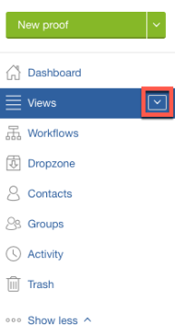

# Opening a Proof in *Workfront Proof*

>[!IMPORTANT]
>
>This article refers to functionality in the standalone product *Workfront Proof*. For information on proofing inside *Adobe Workfront*, see [Proofing](../../../review-and-approve-work/proofing/proofing.md).

<ol> 
 <li value="1">Click the down arrow button next to Views in the side bar. </li> 
 <li value="2">Choose All Items in the menu that appears.</li> 
 <li value="3">Click the Go to Proof icon for the <em>proof</em> you want to view.  Your default <em>proofing viewer</em> launches on a new tab in your browser and the focus switches to that tab. You can have multiple <em>proofs</em> open simultaneously, each on its own tab.</li> 
 <li value="4">Continue with one of the following articles, depending on the <em>proofing</em> viewer you are using. 
  <ul>
   <li>To <em>proof</em> in the <em>Web Proofing Viewer</em>, see <a href="https://support.workfront.com/hc/en-us/sections/115000275214">Reviewing Proofs in the <em>Web Proofing Viewer</em>.</a></li>
   <li>To <em>proof</em> in the <em>Desktop Proofing Viewer</em>, see <a href="https://support.workfront.com/hc/en-us/search/click?data=BAh7CjoHaWRsKwjm7%2BTRUwA6CXR5cGVJIgxhcnRpY2xlBjoGRVQ6CHVybEkiVC9oYy9lbi11cy9hcnRpY2xlcy8zNjAwMDM3MjczMzQtUmV2aWV3aW5nLVByb29mcy1pbi10aGUtRGVza3RvcC1Qcm9vZmluZy1WaWV3ZXIGOwdUOg5zZWFyY2hfaWRJIik0NDIyMjdkZi0zYTA4LTQ2YjItYTdkMy1kYzM1YjhlN2U4MjUGOwdGOglyYW5raQc%3D--2056c434cf6f4f97ca87532493ebfeb67ca07b63">Reviewing Proofs in the <em>Desktop Proofing Viewer</em>.</a></li><draft-comment>
    <li data-mc-conditions="QuicksilverOrClassic.Draft mode">To <em>proof</em> in the Legacy <em>proofing viewer</em>, see <a href="../../../review-and-approve-work/proofing/reviewing-proofs-within-workfront/review-proof-in-legacy-proofing-viewer.md" class="MCXref xref">Reviewing a Proof in the Legacy Proofing Viewer</a>.&nbsp;You might not have access to this functionality because it is supported by Flash, which has been deprecated in most environments. &nbsp;</li>
   </draft-comment>
   <li data-mc-conditions="QuicksilverOrClassic.Draft mode">To <em>proof</em> in the Legacy <em>proofing viewer</em>, see <a href="../../../review-and-approve-work/proofing/reviewing-proofs-within-workfront/review-proof-in-legacy-proofing-viewer.md" class="MCXref xref">Reviewing a Proof in the Legacy Proofing Viewer</a>.&nbsp;You might not have access to this functionality because it is supported by Flash, which has been deprecated in most environments. &nbsp;</li>
  </ul> To learn more about the <em>proofing</em> viewers, see&nbsp;<a href="../../../review-and-approve-work/proofing/proofing-overview/understand-differences-between-web-viewer.md" class="MCXref xref">Differences between the Web Proofing Viewer and the Desktop Proofing Viewer overview</a>.</li> 
</ol>

