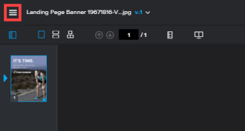
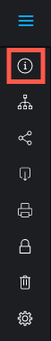

# View activity on a *`proof`* in the *`proofing viewer`* {#view-activity-on-a-proof-in-the-proofing-viewer}

>[!IMPORTANT] {type="important"}
>
>This article refers to functionality in the standalone product *`Workfront Proof`*. For information on proofing inside *`Adobe Workfront`*, see [Proofing](_proofing.md).

You can view the recent activity for a given *`proof`*. This includes all activity and decisions made by any user assigned to the *`proof`*.&nbsp;

1.  If the left toolbar is not displayed, click the `Menu` icon on the upper-left corner of the *`proofing viewer`*.  

   

1.  In the toolbar on the left of the *`proofing viewer`*, click the `Proof Details`button.  

   

1. On the `Proof Details` page that appears, with `Proof Details` selected, view the *`proof`*'s details, status, and progress.

1. For information about *`proof`* state, see&nbsp; [Understand Proof State in Workfront Proof](proof-state.md).  

1. For information about *`proof`* progress, see&nbsp; [View the Progress and Status of a Proof in Workfront Proof](view-progress-and-status-of-proof.md).

1. Click  `Proof activity`to view the following information: 
    
    
    * `Date`:&nbsp;The time and date the action took place.
    * `Action`: The action that occurred on the *`proof`*.&nbsp;
    
    * `Details`:&nbsp;The user who performed the action.
    
    

